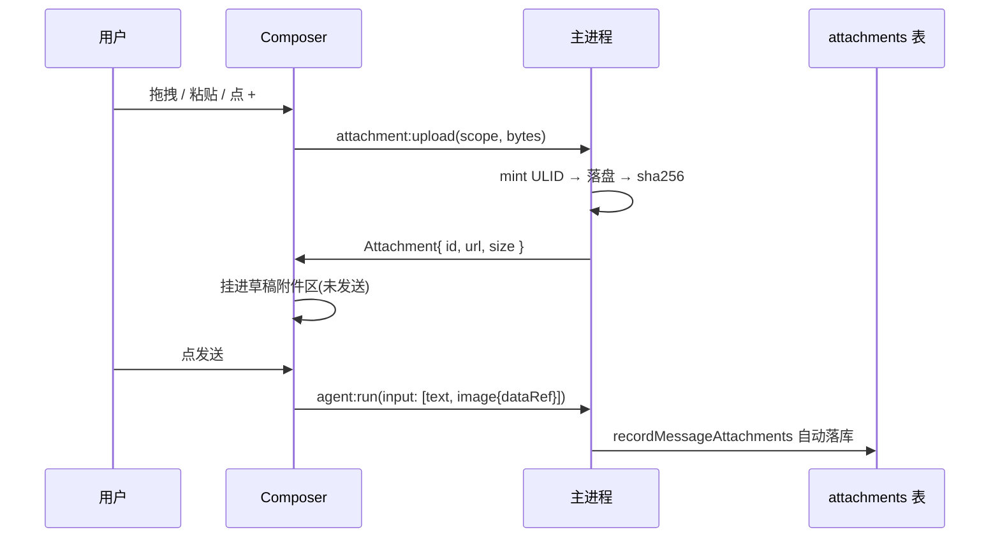

# 附件上传与静态资源协议设计方案

> 目标：一套**系统通用**的附件上传、存储、寻址机制。文件统一落在应用数据目录下按
> 会话／类型分目录，渲染层通过自定义协议 `ncw://` 直接引用，不再走 IPC 传字节。

---

## 0. 现状核验

### 0.1 已经存在的资产（不要重建）

| 资产 | 位置 | 说明 |
|---|---|---|
| 附件根目录 | `ipc/storage.ts:59,79` | `ATTACHMENTS_DIR = 'attachments'`，根 = `app.getPath('userData')/attachments` |
| `attachments` 表 | `db/schema.ts:284` | `id / session_id / message_id / path / size / checksum / created_at`，两条 FK 均 `ON DELETE CASCADE` |
| 落库入口 | `db/repo.ts:280` `recordMessageAttachments` | 从 `ContentPart` 里筛 `type==='image'`，把 `dataRef` 当路径记录，`statSync` 取 size |
| 孤儿清理 | `ipc/storage.ts:577` `cleanupAttachments` | 扫根目录，凡不在 `referencedAttachmentPaths()` 里的**一律 unlink** |
| 存储统计 | `storage:cleanupPreview` / `getStats` | 已按 `attachments` 表聚合字节数 |
| 路径守卫 | `ipc/storage.ts` `isWithin` | 现成的逃逸校验，协议 handler 直接复用 |

**结论：存储层已经建好，本方案要补的是「进」（上传）和「出」（协议寻址）两端。**

### 0.2 三个缺口

- **G1 — 没有任何自定义协议**。全仓库无 `protocol.handle` / `registerSchemesAsPrivileged`。
  现在渲染层要显示一张本地图，只能走 `theme:readImage` 那种 **IPC 传 `Uint8Array`** 的路子
  （`ipc/theme.ts:206`）：每显示一张图就把整个文件塞进一次结构化克隆，且拿不到浏览器的
  图片解码流水线、缓存、Range 请求。
- **G2 — 没有上传入口**。`Composer` 只有一个 `+` 按钮占位；`send()` 的 `input` 写死
  `[{ type: 'text', text }]`。上一轮队列改造已给 `send` 留了可选 `parts` 参数，
  `batchToParts()` 也已经能产出 `{ type:'image', dataRef }`，**接口就位、产源为空**。
- **G3 — CSP 会静默拦截新协议**。`renderer/index.html:13` 是严格策略：
  ```
  img-src 'self' data: blob:
  ```
  不把 `ncw:` 加进去的话，`` 不报错、不加载，控制台只有一行 CSP 警告 ——
  典型的「代码全对但图就是不出来」。

### 0.3 命名对齐

需求里写的是 `.next-cowork`，但仓库既定约定是 **`.nextcowork`（无连字符）**
（`kernel/skill/load.ts:42` 的 `PROJECT_SKILLS_PREFIX`，已用于 `<workspaceRoot>/.nextcowork/skills|agents`）。
本方案统一用 `.nextcowork`；且经确认，附件根**不放工作区**，沿用 `userData/attachments`。

---

## 1. 目录布局

```
<userData>/attachments/               ← 既有的 ATTACHMENTS_DIR，就是需求里说的 files/
├── sessions/
│   └── <sessionId>/
│       ├── 01J8X....png              ← 文件名 = ULID + 原扩展名
│       └── 01J8Y....pdf
├── themes/
│   └── 01J8Z....png                  ← 主题图（迁移目标，见 §7）
└── exports/
    └── <runId>/...
```

**不套 `attachments/files/` 双层同义目录** —— `ATTACHMENTS_DIR` 已经扮演了 `files` 那一级。

### 1.1 为什么文件名是 ULID 而不是原始名

**用户提供的文件名绝不进路径。** 三个理由，任意一个都足够：

1. **路径注入**：`../../../.ssh/id_rsa` 这种名字直接拼进 `join()` 就逃出去了。
2. **重名**：同一会话传两次 `截图.png`，后者覆盖前者，而前一条消息还引用着它。
3. **跨平台**：Windows 的保留名（`CON` / `NUL`）、大小写不敏感、非法字符集与 macOS/Linux 都不同。

原始文件名存进**元数据**（`attachments` 表可用 checksum 列旁的扩展，或消息 part 自带），
UI 显示它，磁盘上不认它。这条是安全边界，不是洁癖。

### 1.2 scope 的类型定义

```ts
// src/shared/domain/attachment.ts

/**
 * ★ `session` 之外的 scope 都是**无主**的 —— 它们不挂在任何 sessionId 上,
 * 于是不会被 `attachments` 表的 ON DELETE CASCADE 带走。这直接决定了
 * §6 那条清理规则必须改,否则它们会被当孤儿删掉。
 */
export type AttachmentScope = 'session' | 'theme' | 'export'

export interface AttachmentLocator {
  scope: AttachmentScope
  /** session 时是 sessionId;theme/export 时可缺省(落在 scope 根目录下) */
  ownerId?: string
  /** ULID + 扩展名。**不是原始文件名** */
  fileName: string
}
```

---

## 2. 自定义协议 `ncw://`

### 2.1 URL 形态

```
ncw://attachments/sessions/01J8ABC.../01J8X....png
      └────┬────┘ └──────────────┬──────────────┘
        host                  pathname
     固定命名空间          直接映射目录结构
```

**为什么 host 固定为 `attachments` 而不是把 scope 放 host**：standard scheme 下
host 会被**强制小写**，而 pathname 不会。sessionId 是 ULID（含大写字母），
放进 host 就被改写了，寻址直接失败。把所有可变部分留在 pathname 里，这个坑就不存在。

host 保留下来是给将来的第二个命名空间用的（如 `ncw://preview/...` 做缩略图）。

### 2.2 注册时机 —— 两段，顺序不能反

```ts
// src/main/index.ts —— ★ 必须在 app.whenReady() 之前
protocol.registerSchemesAsPrivileged([
  {
    scheme: 'ncw',
    privileges: {
      standard: true,        // 走标准 URL 解析,才有正常的 host/pathname 语义
      secure: true,          // 视同 https:,否则被当不安全来源,CSP 与 fetch 都会拦
      supportFetchAPI: true, // 渲染层可以 fetch('ncw://...') 拿 blob
      stream: true,          // ★ 视频/音频的 Range 请求靠它,否则大文件只能整包读
      corsEnabled: false     // 同源自用,不开放跨源
    }
  }
])
```

**这一步放到 ready 之后就完全无效，且不报错** —— 协议能注册成功，但 `standard`/`secure`
全部丢失，表现是「图片有时能显示、fetch 报 CORS、视频不能拖进度条」这类散装症状。

```ts
// app.whenReady() 之后
protocol.handle('ncw', handleAttachmentRequest)
```

### 2.3 handler —— 转发给 `net.fetch` 而不是自己读文件

```ts
// src/main/net/attachment-protocol.ts
import { net, protocol } from 'electron'
import { pathToFileURL } from 'node:url'
import { join, resolve } from 'node:path'

export function handleAttachmentRequest(request: Request): Promise<Response> {
  const url = new URL(request.url)
  if (url.host !== 'attachments') return notFound()

  // ★ decodeURIComponent 必须在 join 之前,且解码后要重新校验 ——
  //   `%2e%2e%2f` 解码出来就是 `../`,只在解码前检查等于没检查。
  const rel = decodeURIComponent(url.pathname).replace(/^\/+/, '')
  const root = attachmentDirectory()
  const target = resolve(join(root, rel))

  // ★ 唯一的安全边界。协议 handler 是**渲染层可以任意构造输入**的入口,
  //   与 `workspace:listDir` 同级别的不可信输入。
  if (!isWithin(root, target)) return forbidden()

  // ★ 交给 net.fetch 而不是 readFileSync:
  //   - Range 请求(视频拖进度条)由它处理,自己实现要解析 Range 头 + 拼 206 响应
  //   - 大文件走流,不整包进内存
  //   - Content-Type 仍需自己给:file:// 的推断在各平台不一致
  const res = await net.fetch(pathToFileURL(target).toString())
  return new Response(res.body, {
    status: res.status,
    headers: {
      'Content-Type': mimeOfExt(target),
      // 内容寻址(文件名是 ULID,永不复用)→ 可以长缓存
      'Cache-Control': 'public, max-age=31536000, immutable'
    }
  })
}
```

**`immutable` 长缓存是安全的**，正因为 §1.1 那条：文件名是 ULID，同一个 URL 的内容
永远不变。若文件名可复用（如原始名），这个头就会把旧图钉死在缓存里。

### 2.4 CSP 必须同步放开

`renderer/index.html` 与 `electron.vite.config.ts` 的 `cspPlugin` **两处都要改**
（后者是 dev 版，漏改的话开发时正常、打包后失效 —— 最难查的那种）：

```
img-src 'self' data: blob: ncw:;
media-src 'self' ncw:;
connect-src 'self' ncw:;      ← fetch('ncw://...') 需要
```

---

## 3. 数据模型

```ts
// src/shared/domain/attachment.ts

export interface Attachment {
  /** ULID。同时是磁盘文件名的主干 */
  id: string
  scope: AttachmentScope
  ownerId?: string
  /** 用户看到的名字。**只用于显示**,不参与任何路径拼接 */
  displayName: string
  mime: string
  size: number
  /** sha256。用于同一 scope 内去重(§5.3) */
  checksum: string
  createdAt: number
  /** ★ 渲染层唯一该用的字段 —— 绝对路径不出主进程 */
  url: string
}

/** 上传请求：渲染层给字节,主进程决定落哪 */
export interface AttachmentUploadRequest {
  scope: AttachmentScope
  ownerId?: string
  displayName: string
  mime: string
  bytes: Uint8Array<ArrayBuffer>
}
```

**`url` 而不是 `path`**：绝对路径是主进程的内部事实，渲染层拿到它除了拼字符串没有别的用途，
而一旦泄漏出去，将来改目录结构就要同时改渲染层。给 `ncw://` URL 则是一个稳定契约。

> `Uint8Array<ArrayBuffer>` 的泛型不是装饰 —— 与 `ImportedImage.bytes` 同一个理由
> （`contract.ts` 里那段注释）：裸 `Uint8Array` 推出来含 `SharedArrayBuffer`，`new Blob([bytes])` 不给过。

---

## 4. 上传链路



### 4.1 三个入口，一条路径

拖拽、粘贴、文件选择器**都归一到同一个 `attachment:upload`**。区别只在怎么拿到字节：

| 入口 | 取字节 | 注意 |
|---|---|---|
| 点 `+` | `dialog.showOpenDialog`（主进程） | ★ 渲染层永不指定任意路径（方案 §9），与 `workspace:pick` 同规则 |
| 拖拽 | `DataTransfer.files` → `arrayBuffer()` | 拖进来的可能是目录，要过滤 |
| 粘贴 | `ClipboardEvent.clipboardData.files` | 截图粘贴是**最高频**入口，`displayName` 常为空，需兜底成 `粘贴图片-<时间>.png` |

### 4.2 与 `ContentPart` 的衔接

上传完成后**不立即发送**，先挂在草稿上。发送时转成 part：

```ts
const parts: ContentPart[] = [
  { type: 'text', text },
  ...attachments.map((a) => ({ type: 'image' as const, mime: a.mime, dataRef: a.url }))
]
void send(text, opts, parts)
```

**★ `dataRef` 存 `ncw://` URL 还是绝对路径？**

存 **URL**。理由：`recordMessageAttachments` 会把 `dataRef` 直接当路径去 `statSync`，
存 URL 会让 `size` 恒为 0。所以 **`repo.ts:280` 需要一处配套改动**：先把 `ncw://` URL
解析回绝对路径再 stat。

反过来（存绝对路径）则要求渲染层每次显示都做一次路径→URL 转换，且绝对路径会被写进转录、
随导出漂到别的机器上——那是一条永远指向不存在位置的记录。**URL 是可迁移的，路径不是。**

---

## 5. 服务与 IPC

### 5.1 通道

```ts
// IpcInvokeMap
'attachment:upload': { req: AttachmentUploadRequest; res: Attachment }
/** 走主进程 dialog,渲染层永不指定路径。返回已落盘的多个附件 */
'attachment:pick': { req: { scope: AttachmentScope; ownerId?: string }; res: Attachment[] }
'attachment:remove': { req: { id: string }; res: void }
/** 会话内已上传但还没发出去的 —— 重启后要能恢复草稿附件区 */
'attachment:listBySession': { req: { sessionId: string }; res: Attachment[] }
```

**全部走 `invoke`**：上传要知道成败与落点，与 Tab 布局那种「发了就不管」不同。

### 5.2 落盘顺序

```ts
export async function uploadAttachment(req: AttachmentUploadRequest): Promise<Attachment> {
  if (req.bytes.byteLength > MAX_ATTACHMENT_BYTES) throw new IpcError('unknown', '文件超过上限')

  const id = ulid()
  const dir = attachmentDirFor(req.scope, req.ownerId)
  mkdirSync(dir, { recursive: true })

  const checksum = sha256(req.bytes)
  // ★ 同 scope 内去重:同一张截图粘三次只存一份。
  //   命中时**不写新文件**,直接返回已有记录 —— 这是最省事也最有效的一条省空间规则。
  const hit = repo.findAttachmentByChecksum(checksum, req.scope, req.ownerId)
  if (hit !== undefined) return hit

  const fileName = `${id}${extOfMime(req.mime)}`
  // ★ 先写临时文件再 rename:写一半崩掉会留下一个**看起来正常但内容截断**的文件,
  //   而它的 checksum 已经进了表 —— 下次去重会命中这个坏文件。
  const tmp = join(dir, `.${fileName}.tmp`)
  writeFileSync(tmp, req.bytes)
  renameSync(tmp, join(dir, fileName))
  ...
}
```

### 5.3 上限

| 项 | 值 | 理由 |
|---|---|---|
| 单文件 | 32 MB | 超过这个量级 IPC 结构化克隆本身就是几百毫秒的卡顿 |
| 单会话累计 | 不设硬限 | 由存储页的清理入口管，硬限会在用户最需要的时候拦住他 |

---

## 6. 清理规则必须改（否则会误删）

**这是本方案里最容易翻车的一处。**

现有 `cleanupAttachments()`（`storage.ts:577`）的逻辑是：

```
扫 attachmentDirectory() 下所有文件 → 不在 referencedAttachmentPaths() 里的 → unlink
```

而 `referencedAttachmentPaths()` 只读 `attachments` 表，那张表**只记录已提交到消息里的会话附件**。
于是把 theme / export 放进同一个根之后：

- 主题图不在表里 → **被当孤儿删掉**
- 已上传但还没发送的草稿附件不在表里 → **用户挑好图去倒杯水，回来清理跑过一次，图没了**

三条修正，缺一不可：

1. **`attachments` 表补 `scope` 与 `status` 两列**（新迁移，`schema.ts` 只增不改）：
   `status: 'draft' | 'committed'`。上传即插入 `draft` 行，`recordMessageAttachments` 时升为 `committed`。
2. **清理只扫 `sessions/` 子树**，`themes/` / `exports/` 由各自的 sweep 负责
   （theme 已有 `sweepOrphans`，`ipc/theme.ts:301`）。
3. **`draft` 行有 TTL**（建议 7 天）：只删「既是 draft 又超期」的，
   而不是「不在表里就删」。孤儿的定义从「表里没有」收紧为「表里标记为可回收」。

> 判据的变化是关键：原规则默认「磁盘是脏的、表是权威」，
> 而一旦有多种资源共用一个根，表就不再覆盖全集，那个默认就变成了误删。

---

## 7. 迁移 theme 到协议（可选，但省一大块代码）

`theme:readImage` 目前把整张图作为 `Uint8Array` 走 IPC 回渲染层，渲染层再 `new Blob` → `createObjectURL`。
换成 `ncw://attachments/themes/<id>.png` 之后：

- 省掉一次全量拷贝与一次 Blob 构造
- 图片走浏览器解码流水线与磁盘缓存，切主题不再每次重读
- `ImportedImage.bytes` 那段 `Uint8Array<ArrayBuffer>` 泛型的注释可以整段删掉

**代价**：`theme:importImage` 的两相流程（先给字节、渲染层解码算色板、再 `theme:saveImage` 落表）
仍然需要字节，不能全砍。所以是「显示走协议、导入仍走字节」。

---

## 8. UI

```
Composer
├── AttachmentTray          ← 新增：草稿附件区，在输入框上沿
│   └── AttachmentChip ×N       缩略图 / 文件图标 + 名字 + 删除
└── (既有的药丸行)
```

```ts
export function AttachmentTray({
  items,
  onRemove
}: {
  items: Attachment[]
  onRemove: (id: string) => void
}): ReactNode
```

- 图片类 chip 直接 `` —— 这是协议存在的意义，不再有 blob URL 的生命周期管理
- 非图片显示扩展名图标 + `displayName`（原始名在这里，也只在这里）
- 上传中显示确定性进度条（字节已知），失败的 chip 保留并给重试，**不静默消失**

**与插入队列的衔接**：`QueuedInput.attachments` 与 `batchToParts()` 上一轮已经就位，
`QueuedAttachment.path` 改存 `url` 即可，队列行尾的「· 2 图片」立刻有真实数据。

---

## 9. 边界与异常

| 场景 | 处理 |
|---|---|
| 拖入目录 | 过滤掉，提示「暂不支持文件夹」。不递归展开——一个 `node_modules` 能拖进来几万个文件 |
| 同名不同内容 | 磁盘上是两个 ULID，互不影响；UI 显示同名，靠 chip 顺序区分 |
| 同内容不同名 | checksum 去重命中，只存一份，但 `displayName` 各记各的 |
| 上传中切会话 | 上传是 `invoke`，与 UI 无关，完成后写进目标会话的草稿附件区 |
| 上传中关闭应用 | 临时文件 `.xxx.tmp` 残留 → 启动时扫 `sessions/` 删掉所有 `.tmp` |
| 文件被外部删除 | 协议返回 404，`` 走 `onError` 显示占位；`cleanupAttachments` 已有「表里有、磁盘无」的行清理 |
| 转录导入到另一台机器 | `ncw://` URL 指向本机不存在的 id → 404 占位。**这是正确行为**，比绝对路径至少不会指到别人的家目录 |
| 协议被渲染层构造恶意路径 | `isWithin` 拦截，返回 403。这是唯一的安全边界，必须有单测覆盖 `%2e%2e%2f` 与符号链接 |

---

## 10. 落地批次

| 批次 | 内容 | 可独立合并 |
|---|---|---|
| **1** | `shared/domain/attachment.ts` 类型 + 路径解析纯函数（`attachmentRelPath` / `parseNcwUrl`）+ 单测 | ✅ |
| **2** | 协议注册与 handler（`main/index.ts` + `net/attachment-protocol.ts`）+ CSP 两处 + 逃逸单测 | ✅ |
| **3** | `attachment:upload/pick/remove/list` 四通道 + `ipc/attachment.ts` + 服务层 | 依赖 1 |
| **4** | 迁移：`schema.ts` 加 `scope`/`status` 列，`cleanupAttachments` 改按子树 + TTL | 依赖 3 |
| **5** | `AttachmentTray` + Composer 三入口（拖/粘/选）+ `send` 带 parts | 依赖 3 |
| **6** | `repo.ts:280` 支持 `ncw://` 反解；theme 显示改走协议（可选） | 依赖 2 |

**批次 2 可以完全独立验证**：注册协议后随便往 `attachments/sessions/test/` 丢一张图，
在 devtools 里 `fetch('ncw://attachments/sessions/test/a.png')` 就能验通，不需要任何上传 UI。

---

## 11. 取舍与替代方案

| 决策 | 选定 | 被否方案与原因 |
|---|---|---|
| 存储根 | `userData/attachments` | **工作区 `.nextcowork/files`** —— 要推翻已建好的清理/统计链路；会进 git；会话跨工作区时无处可放 |
| 寻址 | `ncw://` 自定义协议 | **IPC 传字节**（现状）——每显示一次全量拷贝一次，无缓存、无 Range；**`file://`** —— 要关 `webSecurity`，等于拆掉整个沙箱 |
| handler 实现 | 转发 `net.fetch(file://)` | **自己 `readFileSync`** —— 要手写 Range 解析与 206 响应，大文件整包进内存 |
| 磁盘文件名 | ULID + 扩展名 | **原始文件名** —— 路径注入、重名覆盖、跨平台非法字符，三个问题一次全占 |
| `dataRef` 内容 | `ncw://` URL | **绝对路径** —— 会随转录导出漂到别的机器，成为永远指向不存在位置的记录 |
| 去重 | 同 scope 内按 checksum | **全局去重** —— 删一个会话会波及另一个会话仍在引用的文件，引用计数的复杂度不值当 |
| 孤儿判据 | `draft` 且超 TTL | **不在表里就删**（现状）—— 多资源共用一个根之后，这条会删掉主题图和草稿附件 |
| 上传通道 | `invoke` | **`send`** —— 上传必须知道成败与落点 |

**分档建议**：
- 只需要贴图对话：批次 1／2／3／5 就够，`themes` 迁移和 `scope` 列可以推后。
- 要做「任务产出文件」审查：批次 4 的 `scope`/`status` 是前提，否则产出物会被清理误删。
