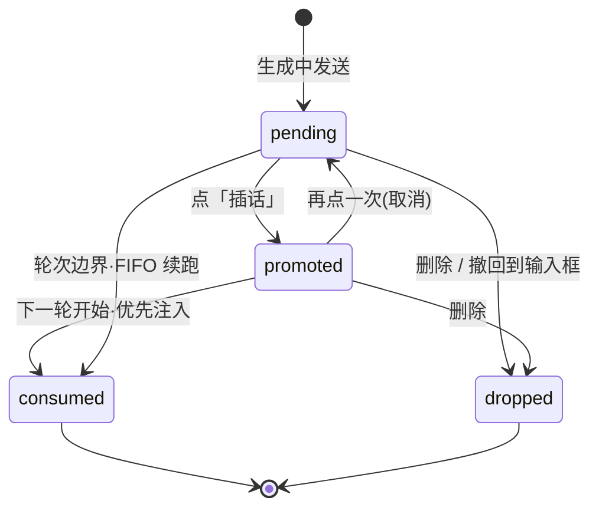

# 插入消息列表（Pending Insert Queue）设计方案

> 对应需求：Agent 执行期间用户消息进入「等待插入队列」；用户可把其中一条标记为「插话」（引入），
> 在下一轮执行开始时立即注入执行上下文，而非等本次 Agent 全部结束后才生效。
>
> 本文只覆盖**这一块 UI 与其状态语义**，不改动 run 调度模型（一个会话同一时刻只有一个 run）。

---

## 0. 现状核验

| 项 | 现状 | 行号 |
|---|---|---|
| 队列数据 | `queuedInputs: string[]` —— **纯字符串数组** | `stores/session.ts:37` |
| 入队 | `send()` 里 `activeRunId !== null` 时 push 文本、清草稿 | `stores/session.ts:68-72` |
| 出队 | `drainQueue()` 取 `[next, ...rest]`，用 `lastOptions` 重发 | `stores/session.ts:174-184` |
| 档位快照 | `lastOptions` —— **整个队列共用一份**，非逐条 | `stores/session.ts:44` |
| 队列的 UI 存在感 | 只有 `StatusLine` 上一个数字 `queued={queuedInputs.length}` | `ChatView.tsx:99` |
| 输入框 | 生成中不禁用，占位符「当前回复完成后按队列继续执行」 | `Composer.tsx:12-13` |

**三条阻塞性缺口**（截图形态无法在现有模型上实现）：

- **G1 — 无条目身份**。`string[]` 里两条内容相同的消息不可区分，`key`、删除、编辑、插话全部无法定位到具体那一条。
- **G2 — 无逐条状态**。「已引入 / 待处理」是条目级属性，字符串装不下。
- **G3 — 无附件**。截图里「· 2 图片」说明条目要带附件计数；且 `lastOptions` 全队列共用，与「每条按发送时看到的设置写」的既有注释精神冲突（排队期间改模型，早入队的那条应保持入队时的档位）。
- **G4 — 队列与草稿都只在内存里**。`draft` 的注释只承诺「切 Tab 不能丢」，`queuedInputs` 连这句都没有。二者都活在 `sessionStore` 的 zustand state 中，**进程一退出就永久消失**——而它们恰恰是全应用唯一没有第二份副本的数据（已发出的内容至少还在转录里）。见 §8。

---

## 1. 图上信息解剖

两张参考图的差别只是**折叠态**与**展开编辑态**，结构同源。自上而下三层，同属输入框上方的浮层栈：

```
┌─ ComposerOverlay ────────────────────────────────┐
│  ① TodoProgressBar   「实现批次3三层折叠 (2/6)」 ─▬─ ×  │  ← 另一需求，本文只定边界
│  ② PendingQueue                                        │
│     ├ QueueItem  ↳插话 · 🗑 · ⋯                        │
│     └ QueueItem（展开为 Editor：textarea + 取消/保存）   │
└──────────────────────────────────────────────────┘
┌─ Composer ───────────────────────────────────────┐
│  「当前回复完成后按队列继续执行」                        │
│  + 🖼 [完全访问]              [模型 ▾]  ●发送/停止      │
└──────────────────────────────────────────────────┘
```

逐条读出的约束：

| 观察点 | 设计含义 |
|---|---|
| 折叠态每条**只占一行**，文本单行省略 | 行高固定，摘要必须是单行截断，不能因内容长短跳高 |
| 行尾常驻 `↳ 插话`／🗑／`⋯` 三个操作 | 主操作（插话）**不藏在 hover 里**——排队场景用户就是冲它来的 |
| 文本尾部 `· 2 图片` | 附件以计数后缀呈现，不铺缩略图（会破坏单行高度） |
| 编辑态是**白底卡片 + 独立取消/保存** | 编辑是显式事务，不是 blur 即存——避免误改后无从撤销 |
| 「保存」是主色实心，「取消」是幽灵按钮 | 沿用项目既有按钮层级 |
| 输入框**不禁用**、占位符仍是队列文案 | 队列区出现不改变输入框行为，仍可继续追加入队 |
| 顶部 `(2/6)` 与右侧进度条 | 那是 Todo 进度，**不是队列计数**；队列自己的计数放在折叠头 |

---

## 2. 数据模型

### 2.1 条目类型

新建 `src/shared/domain/queued-input.ts`（沿用现有命名风格：`sessionId` / `runId` / `queuedInputs` / `lastOptions`）：

```ts
import type { SendOptions } from '../../renderer/src/stores/session' // 实际抽到 shared/agent/run-request

/** 附件——截图里的「· 2 图片」 */
export interface QueuedAttachment {
  kind: 'image' | 'file'
  name: string
  /** 绝对路径。入队时已落盘，注入时直接引用，不做二次拷贝 */
  path: string
}

/**
 * 条目状态。★ 只有 pending / promoted 会出现在列表里；
 * consumed / dropped 是**终态**，用于事后回溯与 e2e 断言，不渲染。
 */
export type QueuedInputStatus = 'pending' | 'promoted' | 'consumed' | 'dropped'

export interface QueuedInput {
  /** 入队时 mint(ulid)，全程不变 —— 列表 key、编辑/删除/插话都靠它定位(补 G1) */
  id: string
  text: string
  attachments: QueuedAttachment[]
  status: QueuedInputStatus
  /**
   * ★ 入队时**逐条冻结**的档位快照(补 G3)。
   * 现有注释已经写明「不能读当时的 UI 值」——这里把那条规则从
   * 全队列一份的 `lastOptions` 收紧到每条一份。
   */
  options: SendOptions
  enqueuedAt: number
  /** 点「插话」的时刻。多条同时被引入时，它决定注入顺序 */
  promotedAt?: number
  /** 最终消费它的 run。中断后回溯「这条到底发出去没有」的唯一依据 */
  consumedByRunId?: string
}
```

### 2.2 store 字段变更

```ts
export interface SessionState {
  // ...
  /** ★ string[] → QueuedInput[]。只保留非终态条目；终态直接移出数组 */
  queuedInputs: QueuedInput[]

  enqueueInput: (text: string, opts: SendOptions, attachments?: QueuedAttachment[]) => void
  promoteInput: (id: string) => void      // 插话 / 取消插话(toggle)
  editInput: (id: string, text: string) => void
  dropInput: (id: string) => void
  moveInputToDraft: (id: string) => void  // 「⋯」里的「撤回到输入框」
}
```

**字段名保持 `queuedInputs` 不变**——它已被 `ChatView.tsx:99`、`isSessionUntouched()`、既有单测引用；改名会把三处无关代码卷进来。只换元素类型，配套修 `queuedInputs.length` 之外的两处解构。

---

## 3. 状态流转



### 3.1 完整流程

1. **入队**：`activeRunId !== null` 时 `send()` 不发起 run，改为 `enqueueInput()`——mint `id`、冻结 `options`、`status = 'pending'`、清空 `draft`。此处即现有 `session.ts:68-72` 的位置，只是从 push 字符串换成 push 对象。
2. **引入**：用户点行尾「插话」→ `promoteInput(id)` → `status = 'promoted'`、`promotedAt = now`。**不发起任何请求**，纯本地状态。
3. **轮次边界**：`activeRunId` 由 non-null 跃迁为 `null`（即 `settleRun` 落地）的瞬间，就是唯一的轮次边界。此刻 `drainQueue()` 被触发。
4. **注入**：`drainQueue()` 按 §4.2 的选取规则组装下一轮输入 → 被选中的条目置 `consumed`、写 `consumedByRunId` 并移出数组 → 调用 `send()`。

> **「立即插入下一轮」的准确含义**：不是在当前 run 执行中途塞进上下文（那需要中断 run，与「不会中断当前执行」的需求相悖），而是**在下一轮 run 的 `input` 里排在最前**，且不必按 FIFO 排队等前面的条目先跑完若干轮。

---

## 4. 关键设计点

### 4.1 轮次边界的判定

以 `activeRunId: string | null` 的 `non-null → null` 跃迁为准，**不用 `RunStatus`**。理由：`done` / `error` / `aborted` 三种终态都要触发边界判定（处理方式不同，见 §5），而 `activeRunId` 是唯一对三者一致的信号，且它已经是现有 `drainQueue()` 的守卫条件。

### 4.2 多条同时被引入：顺序与合并

**规则：全部 `promoted` 条目合并为下一轮的单次输入，按 `promotedAt` 升序拼接。**

```ts
function pickNextBatch(queue: QueuedInput[]): QueuedInput[] {
  const promoted = queue
    .filter((q) => q.status === 'promoted')
    .sort((a, b) => (a.promotedAt ?? 0) - (b.promotedAt ?? 0))
  if (promoted.length > 0) return promoted
  // 没有引入项时退回原 FIFO 行为——现状不变
  const [next] = queue.filter((q) => q.status === 'pending')
  return next ? [next] : []
}

/** 合并：段落间空行分隔，附件按顺序去重后合并 */
function mergeBatch(batch: QueuedInput[]): { text: string; attachments: QueuedAttachment[] } {
  return {
    text: batch.map((q) => q.text.trim()).filter(Boolean).join('\n\n'),
    attachments: dedupeByPath(batch.flatMap((q) => q.attachments))
  }
}
```

**为什么合并成一条而不是连发多个 run**：run 是串行的，发 N 个 run 等于把「插话」重新变成排队，第 2 条要等第 1 条整轮跑完——正好抵消掉引入机制的意义。合并成一次输入才满足「下一轮开始时立即插入」。

**合并后的档位取哪份**：取 `batch[0].options`，即**最早被引入**那条的快照。理由与既有注释一致——用户按他当时看到的设置写下这句话；批次以第一条为基准，其余条目的档位差异在 UI 上以「⋯ → 查看档位」暴露，不静默覆盖。

**边界**：`promoted` 条目合并后总文本超过阈值（建议 32k 字符）时，只取前 K 条使其不超限，剩余的**退回 `pending` 并提示**，而不是静默截断。

### 4.3 未被引入的消息

**保持 `pending` 不动，行为与现状完全一致**：没有任何 `promoted` 条目时，`drainQueue()` 仍按 FIFO 取第一条续跑。所以「插话」是一个**加塞**语义，而非「只有引入的才会被发送」——用户不点任何按钮，队列的既有行为一字不改。这是本设计对现状最重要的兼容承诺。

### 4.4 编辑

编辑只允许在 `pending` / `promoted` 两个非终态进行，改的是 `text` 与 `attachments`，不重置 `options`（档位仍是入队时刻的快照）也不重置 `promotedAt`（编辑不改变加塞顺序）。保存即写入 store；取消丢弃 textarea 本地 state。

---

## 5. 边界情况

| 场景 | 处理 |
|---|---|
| **点「插话」前 Agent 已结束** | `drainQueue()` 已按 FIFO 取走首条并开新 run。此时队列里剩余条目**照常可插话**，只是本次错过——它们会命中下一轮。UI 上表现为：run 结束瞬间首条从列表消失。若用户希望阻止，须在结束前删除该条。**不做「结束前 300ms 锁定」之类的补偿**——引入额外时序状态换来的确定性不值得。 |
| **队列在空闲态被点「插话」** | `activeRunId === null` 时该条目本就不该存在于队列（空闲时 `send()` 直接发）。若因竞态残留，`promoteInput` 检测到空闲则**直接触发一次 `drainQueue()`**，等价于立即发送。 |
| **队列为空** | `PendingQueue` 整块不渲染（不是渲染一个空框）。`ComposerOverlay` 高度归零，输入框贴回原位。 |
| **重复引入同一条** | `promoteInput` 是 **toggle**：`pending → promoted → pending`。不产生重复条目，`promotedAt` 在回到 `pending` 时清空（再次引入即排到队尾，符合直觉）。 |
| **执行被用户中断（aborted）** | 队列**不清空、不自动续跑**。理由：用户按停止是想接管控制权，此时自动发出下一条等于无视该意图。列表整体加一条提示「已停止，队列暂停」，并把折叠头的主按钮换成「继续执行队列」。 |
| **执行报错（error）** | 同 aborted：不自动续跑。额外理由是防连锁失败——上游报错时自动灌入下一条，往往连着错 N 次并烧掉 N 轮 token。 |
| **同一条被并发操作**（编辑中被 drain 走） | 以 `id` 查找失败即视为已消费：编辑器保存时若 `id` 不在数组中，弹「该消息已发送」并把内容**回填到 `draft`**，不静默丢弃用户输入。 |
| **切换会话 / 关闭 Tab** | 队列随 `sessionStore` 存活，与 `draft` 同级；`isSessionUntouched()` 已把 `queuedInputs.length === 0` 计入，改为 `QueuedInput[]` 后该判断无需改动。 |
| **进程崩溃 / 被强制重启** | 队列与草稿**必须已落盘**，重启后回填（§8）。恢复后**一律不自动续跑**——进程死亡本质上是一次异常中断，与 aborted 同等对待。 |

---

## 6. 组件设计

均放在 `src/renderer/src/views/chat/`。

### 6.1 组件树

```
ChatView
└─ ComposerOverlay          ← 新增：输入框上方浮层栈（Todo 条 + 队列 共用）
   ├─ TodoProgressBar       ← 另一需求，此处只占位
   └─ PendingQueue          ← 本文主体
      ├─ PendingQueueHeader     折叠头：计数 + 展开箭头 + 全局操作
      ├─ PendingQueueItem  ×N   单行：图标 / 摘要 / 附件计数 / 三个操作
      │  └─ QueueItemMenu       「⋯」下拉
      └─ PendingQueueEditor     展开编辑态（同一时刻至多一个）
```

### 6.2 职责与 props

**`PendingQueue`** —— 唯一持有「哪条正在编辑」的组件；**不允许知道** run 如何发起、档位含义。

```ts
export function PendingQueue({
  items,
  running,
  onPromote,
  onEdit,
  onDrop,
  onMoveToDraft
}: {
  items: QueuedInput[]           // 已过滤掉终态
  running: boolean               // 决定折叠头文案与「继续执行队列」按钮
  onPromote: (id: string) => void
  onEdit: (id: string, text: string) => void
  onDrop: (id: string) => void
  onMoveToDraft: (id: string) => void
}): ReactNode
```

内部 state 仅两个：`editingId: string | null`、`collapsed: boolean`。

**`PendingQueueItem`** —— 纯展示 + 事件冒泡，**无自身 state**（编辑态由父级抬升，保证「同一时刻至多一个编辑器」这条不变式在一处实现）。

```ts
export function PendingQueueItem({
  item,
  onPromote,
  onStartEdit,
  onDrop,
  onMoveToDraft
}: {
  item: QueuedInput
  onPromote: () => void
  onStartEdit: () => void
  onDrop: () => void
  onMoveToDraft: () => void
}): ReactNode
```

**`PendingQueueEditor`** —— 受控 textarea + 取消/保存；`Cmd/Ctrl+Enter` = 保存，`Esc` = 取消。

```ts
export function PendingQueueEditor({
  initialText,
  onCancel,
  onSave
}: {
  initialText: string
  onCancel: () => void
  onSave: (text: string) => void
}): ReactNode
```

### 6.3 机器可读属性

沿用 `StatusLine` 确立的约定（`data-*` 是探针读取点，中文文案随时可改）：

```
[data-testid="pending-queue"]        data-count="2" data-promoted="1"
[data-testid="queue-item"]           data-queue-id="01J..." data-queue-status="promoted"
[data-testid="queue-item-promote"]
[data-testid="queue-editor"]
```

---

## 7. 视觉与交互规范

对齐现有 token（`rounded-card`、`text-[12.5px]`、`cn()`）。

| 元素 | 规格 |
|---|---|
| 队列区容器 | 与输入框同宽，底部间距 `8px`；无独立阴影，靠 `border` 与背景色分层 |
| 单行高度 | 固定 `36px`；文本 `text-[12.5px]`、`truncate`；**任何状态都不改变行高** |
| 前导图标 | `CornerDownRight`（`↳`）；`promoted` 态换 `ArrowRightToLine` 并着主色 |
| 附件后缀 | ` · 2 图片`，`text-muted`，与正文同行、不换行 |
| 操作区 | 常驻显示（非 hover-only）：`插话` 文字按钮 + `Trash2` + `MoreHorizontal`，`14px` 图标 |
| `promoted` 行 | 左侧 `2px` 主色竖条 + 背景 `primary/6%`；**不加徽章**（会挤压单行文本） |
| 编辑态 | 卡片白底 + `1px` 边框 + `rounded-card`；textarea `min-h-[88px]`、`max-h-[240px]` 后内滚 |
| 按钮层级 | 「保存」实心主色，「取消」幽灵 |
| 折叠头 | `已排队 2 条 · 1 条待插话`，右侧 `ChevronDown` 旋转 |
| 动效 | 仅两处：条目进出 `height + opacity` `150ms ease-out`；折叠 `180ms`。**不做位移动画**——队列区在输入框上方，位移会顶动输入框造成误点 |
| 无障碍 | 队列区 `role="list"`；`aria-live="polite"` 只播报计数变化，不播报每条内容 |

---

## 8. 持久化

> **这是本设计的核心结论之一。** 「还没发出去」不是不必持久化的理由，恰恰相反——
> 已发出的内容在转录里有据可查，**只有未发出的输入是全世界唯一副本**，
> 进程一死就永久丢失，且用户完全没有再来一次的依据（他甚至不记得自己写过什么）。
> 草稿同理：现有 `draft` 只保证切 Tab 不丢，扛不住重启。

### 8.1 落点判据：复用 `kv` 表

`db/schema.ts` 对 `kv` 表的定义原话是「窗口/Tab 布局这类**易失 UI 状态**」。草稿与队列完全落在同一判据内：

| 判据 | 草稿 + 队列 | 结论 |
|---|---|---|
| 查询形状 | **整行读、整行写**，从不按字段过滤或聚合 | JSON 一列，不拆真列 |
| 行数量级 | 每个会话一行，活跃会话几十个 | 无需索引 |
| 字段演进 | `QueuedInput` 还会加字段 | 存 JSON 则零迁移 |
| 生命周期 | 短于会话，会话删除即失效 | 挂 `kv`，不进 `messages` |

**所以：不新建表、不写迁移。** 只加一个键前缀，沿用 `tabs.outer.` / `tabs.inner.` 的点号命名：

```ts
// src/main/state/store.ts —— 键名属于这一层的词汇,不属于数据库(该文件头注释)
export const sessionInputKey = (sessionId: string): string => `session.input.${sessionId}`
```

### 8.2 持久化载荷

**草稿与队列合成一个键**，不拆两个。理由：同源（都是「未发出的输入」）、同生命周期、同一时刻被读写；拆两个键要付两次 IPC、两套防抖、两次恢复竞态。

```ts
// src/shared/domain/queued-input.ts
export interface SessionInputState {
  /** 结构版本。将来 QueuedInput 破坏性改字段时，读到旧版本直接丢弃而不是崩 */
  v: 1
  draft: string
  /** 只含非终态条目——consumed / dropped 本就已移出数组 */
  queued: QueuedInput[]
  savedAt: number
}
```

**序列化约束**：`QueuedInput.options` 必须是纯数据（`SendOptions` 是 `RunRequest` 的子集，当前满足）。`attachments` 只存 `path` 不存内容——附件早已落盘，二次拷贝毫无意义且会把 kv 行撑爆。落盘前用 `JSON.parse(JSON.stringify(x))` 往返一次作为单测断言即可钉死这条。

**体积上限**：队列软上限 20 条（§9）+ 单条文本 32k 字符上限，最坏约 640KB/会话。超限时**拒绝入队并提示**，不静默截断。

### 8.3 写入时机：两档，不是一档

这是与 `persistOuterTabs` 唯一的不同之处——那边只有一种变更频率，这边有两种：

| 变更源 | 频率 | 通道 | 理由 |
|---|---|---|---|
| `draft` 每次按键 | 每帧级 | `send` + 主进程 **500ms 防抖** | 沿用 `tabs:persistOuter` 的现成做法；丢失窗口 ≤500ms，代价是半个词 |
| 入队 / 插话 / 编辑保存 / 删除 | 离散、低频 | `send` + **立即落盘（flush）** | 频率低到不值得防抖；而丢一整条排队消息的代价远高于丢半个词 |

```ts
// services/app.ts —— 沿用 §「用 send 不用 invoke」的既有理由:渲染层不需要返回值
export function persistSessionInput(
  sessionId: string,
  state: SessionInputState,
  immediate = false
): void {
  send('session:persistInput', { sessionId, state, immediate })
}

export function getSessionInput(sessionId: string): Promise<SessionInputState | null> {
  return invoke('session:getInput', { sessionId })
}
```

主进程侧防抖器在 `immediate` 时取消待定定时器并同步写。另在 `app.on('before-quit')` 里 flush 全部待写项——正常退出不该丢那 500ms。

> **强杀（`kill -9` / 断电）拦不住**，这正是队列变更走立即落盘、只让 `draft` 承担 500ms 风险窗口的原因。

### 8.4 恢复与竞态

`sessionStore` 创建后异步 load 回填。**回填必须带守卫**：

```ts
async function hydrateSessionInput(sessionId: string): Promise<void> {
  const saved = await getSessionInput(sessionId)
  if (saved === null || saved.v !== 1) return

  const store = stores.get(sessionId)
  if (!store) return
  const s = store.getState()

  // ★ 守卫:IPC 往返期间用户可能已经打字或发送了。回填只在「还是干净的」时生效,
  //   否则就会用旧快照盖掉用户刚敲进去的内容 —— 这是持久化最常见的翻车方式。
  //   同 tabs.ts:138 `persisted.tabs.length > 0` 那条守卫的精神。
  if (s.draft !== '' || s.queuedInputs.length > 0 || s.activeRunId !== null) return

  store.setState({ draft: saved.draft, queuedInputs: saved.queued })
}
```

**恢复后不自动续跑**：即便队列非空且 `activeRunId === null`，也**不触发 `drainQueue()`**。用户重启应用时绝不期待它自己开始发消息。折叠头显示「已恢复 N 条 · 继续执行」，由用户点击触发——与 §5 中 aborted 的处理完全一致（进程死亡就是一次异常中断）。

**`promoted` 状态保留**：重启不清 `promotedAt`，用户上次的选择依然有效。

### 8.5 清理

会话删除时移除对应 kv 行，对齐 `state/store.ts:66` 已有的 `repo.removeKv(innerTabKey(id))` 写法：

```ts
repo.removeKv(sessionInputKey(sessionId))
```

另加一条**启动期兜底清扫**：load 时若 `savedAt` 早于 30 天，直接丢弃并删键。否则被遗弃的会话草稿会永久堆积在 kv 里——没有任何一处会主动删它们。

### 8.6 store 改造点

```ts
// session.ts:68-72 —— 入队
if (s.activeRunId !== null) {
  set({
    queuedInputs: [...s.queuedInputs, makeQueuedInput(text, opts, attachments)],
    draft: ''
  })
  return
}

// session.ts:174-184 —— 出队，改为批次选取
function drainQueue(sessionId: string): void {
  const store = stores.get(sessionId)
  if (!store) return
  const s = store.getState()
  if (s.activeRunId !== null) return

  const batch = pickNextBatch(s.queuedInputs)
  if (batch.length === 0) return

  const ids = new Set(batch.map((q) => q.id))
  store.setState({ queuedInputs: s.queuedInputs.filter((q) => !ids.has(q.id)) })

  const { text, attachments } = mergeBatch(batch)
  void s.send(text, { ...batch[0].options, attachments }).catch((err: unknown) => {
    console.error('[agent] 队列续跑失败:', err)
  })
}
```

**调用点收紧**：现有 `drainQueue` 在 run 结束后无条件调用；按 §5 改为仅 `status === 'done'` 时自动调用，`aborted` / `error` 时不调用，改由折叠头的「继续执行队列」手动触发同一函数。

### 8.7 需要跟着改的文件

| 文件 | 改动 |
|---|---|
| `shared/domain/queued-input.ts` | 新建：`QueuedInput` / `QueuedAttachment` / `SessionInputState` |
| `stores/session.ts` | 类型换 + 四个 action + `drainQueue` 批次化 + 调用点收紧 + 每次队列变更调 `persistSessionInput(..., true)` + 创建时 `hydrateSessionInput` |
| `main/state/store.ts` | 加 `sessionInputKey()`；会话删除处补 `removeKv` |
| `main/ipc/app.ts` | 加 `session:persistInput`（`send`，双档防抖）/ `session:getInput`（`invoke`） |
| `services/app.ts` | 加 `persistSessionInput` / `getSessionInput` |
| `views/chat/ChatView.tsx` | `queued={queuedInputs.length}` 保持可用；新增渲染 `<ComposerOverlay>` |
| `stores/__tests__/session.test.ts` | 两处 `toEqual(['第二条'])` 改为按 `id`/`text` 断言 |

**不需要改**：`db/schema.ts`（复用 `kv`，零迁移）、`Panels.tsx`、主进程 run 调度。

---

## 9. 取舍与替代方案

| 决策 | 选定 | 被否方案与原因 |
|---|---|---|
| 引入的注入时机 | 下一轮 run 的 `input` 最前 | **中断当前 run 立即注入**——直接违背「不中断当前执行」；且中断会丢弃已产出的工具结果 |
| 多条引入 | 合并为一次输入 | **连发多个 run**——退化成排队，抵消加塞语义 |
| 未引入的消息 | 保持 FIFO 自动续跑 | **只发引入的、其余丢弃**——是破坏性变更，且与现有占位符文案冲突 |
| 重复引入 | toggle | **报错/无操作**——用户点第二次的意图明确就是取消 |
| 中断/报错后 | 暂停队列，手动继续 | **继续自动续跑**——连锁失败，烧 token |
| 编辑提交 | 显式取消/保存 | **blur 即存**——截图明确画了两个按钮；且误改无从撤销 |
| 数据落点 | **落盘到 `kv` 表**（草稿 + 队列同一个键） | **只放渲染层内存**——强制重启即永久丢失，且未发出的输入是唯一副本；**新建 `session_inputs` 真表**——查询形状是整行读写，拆表换不到查询能力却要写迁移 |
| 写入档位 | 草稿防抖 500ms／队列变更立即 | **统一防抖**——丢一整条排队消息与丢半个词代价不对等；**统一立即写**——按键级频率打爆 SQLite |
| 重启后 | 回填但**不自动续跑** | **自动续跑**——用户重启应用不期待它自己开始发消息 |
| 队列条目上限 | 软上限 20，超出禁止入队并提示 | **无上限**——UI 折叠头撑不住，合并文本必然超上下文，kv 单行也会被撑爆 |

**分档建议**：
- 单条排队（最常见）：折叠头都不必展开，一行直显，「插话」等价于「下一轮先发这条」。
- 2–5 条：本文完整形态。
- \>5 条：真正的问题是用户在用队列当便签，此时应引导「撤回到输入框」合并成一条，而不是把列表做得更能装。
