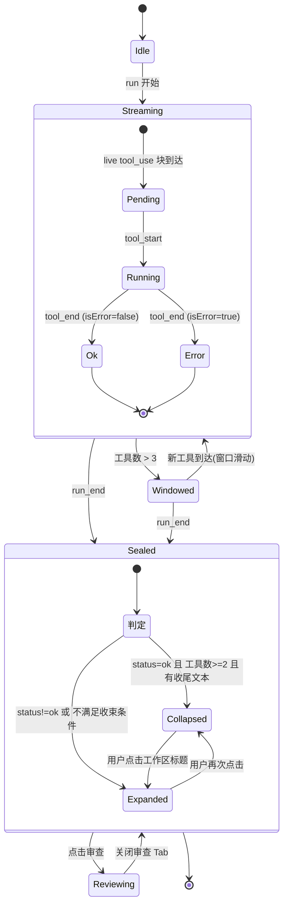

# 工具执行列表（ToolTimeline）整体设计方案

> 适用范围：AI 助手对话界面中，一次 run 内所有工具调用的呈现、折叠、收束与产出审查。
> 代码基线：本文所有「现状」结论均来自 2026-09 当前仓库实际代码，行号可直接跳转核验。
> 本文是实现规范，不是概念文章 —— 每一节要么给出可落地的类型/组件/状态机，要么给出明确裁决。

---

## 0. 现状盘点

### 0.1 渲染链路的实际形状

一次 run 的工具在界面上的完整链路只有三个文件，没有第四处：

```
AgentEvent (主进程)
   → shared/agent/transcript.ts:90  applyEvent()      // 事件 → TranscriptState
   → views/chat/Thread.tsx:149      PartBlock()       // 已提交 parts 分发
   → views/chat/Thread.tsx:198      LiveTurn 内联分发  // 流式 live 块分发
   → views/chat/parts.tsx:67        ToolCallCard()    // 唯一的工具卡片实现
```

关键事实：**已提交的 `parts` 与流式的 `live` 走同一套块渲染器**（`Thread.tsx:4` 的文件头注释明确要求），这是本方案必须继承的硬约束 —— 任何新增的展示能力，如果只在其中一条路径上生效，块从「流式中」变为「已提交」的一瞬就会跳变。

### 0.2 已有的三种块

| 组件 | 位置 | 现状 |
|---|---|---|
| `ThinkingBlock` | `parts.tsx:20` | 可折叠行，`streaming` 时默认展开、提交后收起。有 `Brain` 图标，是唯一有专属图标的块 |
| `ToolCallCard` | `parts.tsx:67` | 所有工具共用。折叠态一行，展开显示「入参 / 结果」两个 `<pre>` |
| `SubagentNode` | `parts.tsx:150` | 仅一行摘要文本，**无折叠、无状态、无展开面板**（`parts.tsx:149` 注释自承「展开面板留到步骤 11」） |

### 0.3 内置工具全集（`src/main/kernel/tool/builtin/index.ts:28`）

注册顺序即数组顺序，且 `echo` 必须在第 0 位（`index.ts:7` 有专门说明，`demo.ts:318` 依赖它）。

| internalId | 文件:行 | readOnly | destructive | needsNetwork |
|---|---|---|---|---|
| `echo` | `echo.ts:40` | ✔ | ✘ | ✘ |
| `Read` | `fs.ts:88` | ✔ | ✘ | ✘ |
| `Write` | `fs.ts:169` | ✘ | ✔ | ✘ |
| `Edit` | `fs.ts:226` | ✘ | ✔ | ✘ |
| `LS` | `fs.ts:307` | ✔ | ✘ | ✘ |
| `Glob` | `search.ts:116` | ✔ | ✘ | ✘ |
| `Grep` | `search.ts:356` | ✔ | ✘ | ✘ |
| `Bash` | `bash.ts:65` | ✘ | ✔ | ✘ |
| `TodoWrite` | `todo.ts:49` | ✔ | ✘ | ✘ |
| `WebFetch` | `web.ts:142` | ✔ | ✘ | ✔ |
| `Skill` | `skill.ts:49` | ✔ | ✘ | ✘ |
| `web_search` | `web-search.ts:62` | ✔ | ✘ | ✔ |
| `Task` | `task.ts:109`（工厂，每次现造） | ✘ | ✘ | ✘ |

外部工具由 `ToolSource`（`shared/agent/tool.ts:20`）建模，共三支：`builtin` / `mcp{serverId}` / `skill{skillId}`。**MCP 工具的 internalId 形如 `mcp__<server>__<tool>`**，且因上游 64 字符限制存在 `externalName` 消毒映射（`tool.ts:26` 说明）—— 这一点直接决定了 §1 的展示规则：**界面必须显示 internalId 派生的人类可读名，而不是 externalName**，否则用户看到的是被哈希截断过的名字。

### 0.4 五处不一致 / 缺口

| # | 现象 | 证据 | 目标形态 |
|---|---|---|---|
| G1 | **零差异化**：13 个内置工具 + 全部 MCP 工具共用一个 `Wrench` 图标 | `parts.tsx:100` 硬编码 `<Wrench>` | 按展示形态分派图标 + 标题模板（§1） |
| G2 | **标题是原始工具名**，`font-mono` 直出 | `parts.tsx:101` `{call?.name ?? name}` | `Read` → 「读取 `src/foo.ts`」；MCP → 「服务器 · 工具名」 |
| G3 | **详情一律 `JSON.stringify`** 塞 `<pre>` | `parts.tsx:121/142`，`stringify()` 在 `parts.tsx:159` | Bash 给终端样式、Edit 给 diff、Grep 给命中列表（§1） |
| G4 | **无耗时字段**：`ToolCallState` 只有 `status/progress/output` | `transcript.ts:28-36` | 增 `startedAt/endedAt`（§4.1） |
| G5 | **折叠是逐卡片独立 `useState`**，无组级概念 | `parts.tsx:78` `const [open, setOpen] = useState(false)` | 三层折叠模型（§5） |
| G6 | **无文件变更聚合、无 diff 视图**；`InnerTabKind` 无 review 档 | `tab.ts:54-66` 七种 kind，无 review | 新增 `review` kind（§7） |
| G7 | **无 pending 态**：`status` 只有 `running/ok/error` | `transcript.ts:32` | 保持三态，pending 由「有 live 块但无 tool_start」派生（§4.1 裁决） |

### 0.5 必须继承的既有约定

1. **机器可读属性**：`parts.tsx:86-87` 的 `data-testid="tool-call"` 与 `data-tool-status={status}` 被 e2e 探针依赖（`parts.tsx:84` 注释写明「读它，而不是去正则中文字」）。新组件全部沿用同一套属性名，新增的组级/工作区节点用 `data-testid="tool-group"` / `"workspace-block"`。
2. **设计 token**：`rounded-card`、`bg-surface-raised/60`、`border-hairline`、`text-[12.5px]`（行内）/ `text-[11px]`（元信息）/ `text-[11.5px]`（代码）、`text-accent` / `text-danger` / `text-fg-faint`。本方案不引入新色值，只引入新的组合规则。
3. **面板不是专用面板**：`Panels.tsx:3` 明确「两个面板都不是专用面板，它们各是一条内层 Tab 条」。因此审查视图**必须**做成 `InnerTab` 的一种 kind，而不是新建一个 ReviewPanel —— 新建面板会同时违反 `tab.ts:26` 的「三格共用一张表」。
4. **不新增事件类型**：耗时通过在 `applyEvent` 的 `tool_start`/`tool_end` 分支打时间戳获得（§4.1），转录格式不迁移。

---

## 1. 工具分类矩阵

### 1.1 分类维度：按「详情长什么样」分，不按「功能」分

分类的唯一判据是**展示形态**，即「展开后详情区应该用哪种渲染器」。功能相近但详情形态不同的工具必须分开（`Read` 与 `Write` 都是 fs，但一个是只读预览、一个是写入 diff）；功能不同但形态相同的可合并（`Glob` 与 `Grep` 都是「命中列表」）。

七类：

| 形态类 | 语义 | 图标 (lucide) | 详情渲染器 |
|---|---|---|---|
| `reasoning` | 模型自我推理，无外部作用 | `Brain` | 纯文本流 |
| `read` | 读取磁盘，不改变状态 | `FileText` | 代码预览（带行号，可折叠到 20 行） |
| `mutate` | 写入磁盘，改变工作区 | `FilePen` | 变更摘要 + inline diff |
| `search` | 检索，产出命中集合 | `Search` | 命中列表（文件:行 + 片段） |
| `command` | 执行 shell | `Terminal` | 终端样式输出（等宽、保留 ANSI 剥离后的换行） |
| `network` | 出网请求 | `Globe` | URL + 响应摘要 |
| `orchestration` | 调度类（子代理、待办、技能） | `ListTree` | 结构化子项列表 |
| `external` | MCP / 未知工具的兜底 | `Plug` | 通用 JSON（现状行为，作为 fallback 保留） |

### 1.2 主表：工具 → 展示契约

`titleOf` 与 `summaryOf` 均为**纯函数**，入参只有 `(input, output)`，不得访问 store —— 这是让它们可单测的前提。

| internalId | 形态类 | 标题模板 | 摘要（折叠态右侧） |
|---|---|---|---|
| `(thinking)` | reasoning | 「深度思考」/ 流式时「正在深度思考…」 | `${sec} 秒` |
| `Read` | read | 「读取 `{basename(file_path)}`」 | `{行数} 行` |
| `LS` | read | 「列目录 `{basename(path)}`」 | `{条目数} 项` |
| `Write` | mutate | 「写入 `{basename(file_path)}`」 | `+{新增行}` 或「新建」 |
| `Edit` | mutate | 「编辑 `{basename(file_path)}`」 | `+{n} -{m}` |
| `Glob` | search | 「查找 `{pattern}`」 | `{命中数} 个文件` |
| `Grep` | search | 「搜索 `{pattern}`」 | `{命中数} 处` |
| `Bash` | command | 「执行 `{cmd 首 40 字符}`」 | `退出码 {n}`（非 0 标红） |
| `WebFetch` | network | 「抓取 `{hostname(url)}`」 | `{响应字节}` |
| `web_search` | network | 「搜索网络：{query}」 | `{结果数} 条` |
| `TodoWrite` | orchestration | 「更新任务清单」 | `{done}/{total}` |
| `Task` | orchestration | 「子代理：{subagent_type}」 | 子 run 状态 |
| `Skill` | orchestration | 「技能：{skill}」 | — |
| `echo` | external | 「echo」 | 原样 |
| `mcp__{s}__{t}` | external | 「{serverLabel} · {humanize(t)}」 | 输出首行截断 |

**MCP 标题的拆名规则**（这是 G2 的核心）：

```ts
/** mcp__github-enterprise__create_pr → { server: 'github-enterprise', tool: 'create_pr' } */
export function parseMcpId(internalId: string): { server: string; tool: string } | null {
  const m = /^mcp__([^_].*?)__(.+)$/.exec(internalId)
  return m && m[1] && m[2] ? { server: m[1], tool: m[2] } : null
}
```

注意用 `internalId`（`ToolInfo.internalId`，`tool.ts:35`），不是 `externalName` —— 后者可能已被截断加哈希。而 `ToolCallState.name` 当前存的是 `tool_start` 事件里的 `toolName`，落地时需确认它取的是 internalId；若取的是 externalName，则在 §9 的改动清单中一并修正事件发射端。

### 1.3 注册表分发，不用 switch

```ts
// shared/domain/tool-presenter.ts
export type ToolShape =
  | 'reasoning' | 'read' | 'mutate' | 'search'
  | 'command' | 'network' | 'orchestration' | 'external'

export interface ToolPresenter {
  shape: ToolShape
  /** 折叠态主标题；拿不到入参时必须仍能返回一个可读串 */
  title: (input: unknown) => string
  /** 折叠态右侧摘要；未完成时返回 undefined */
  summary?: (input: unknown, output: ToolOutput | undefined) => string | undefined
  /** 详情区渲染器的 key，由渲染层的 DETAIL_RENDERERS 查表 */
  detail?: ToolShape
}

const REGISTRY: Record<string, ToolPresenter> = {
  Read: { shape: 'read', title: (i) => `读取 ${base(pick(i, 'file_path'))}` },
  Edit: { shape: 'mutate', title: (i) => `编辑 ${base(pick(i, 'file_path'))}`, summary: editSummary },
  Bash: { shape: 'command', title: (i) => `执行 ${clip(pick(i, 'command'), 40)}` },
  // …
}

const FALLBACK: ToolPresenter = {
  shape: 'external',
  title: (i) => '工具调用'
}

export function presenterOf(name: string): ToolPresenter {
  const hit = REGISTRY[name]
  if (hit) return hit
  const mcp = parseMcpId(name)
  if (mcp) return { shape: 'external', title: () => `${mcp.server} · ${humanize(mcp.tool)}` }
  return FALLBACK
}
```

**为什么是注册表而不是 `switch`**：MCP 工具在编译期不可枚举，`switch` 必然带一个 `default`，而 `default` 一旦存在，新增内置工具忘记加分支时不会有任何编译错误 —— 它会静默落进 fallback。注册表把「已知工具」写成数据后，可以在 `index.test.ts` 里加一条用例断言 `builtinTools().every(t => t.info.internalId in REGISTRY)`，让遗漏在测试期就暴露。

`pick` 必须对 `unknown` 安全：流式中途 `input` 是**未闭合的 JSON 片段字符串**（`Thread.tsx:216` 明确说明），所以：

```ts
function pick(input: unknown, key: string): string {
  if (typeof input !== 'object' || input === null) return ''
  const v = (input as Record<string, unknown>)[key]
  return typeof v === 'string' ? v : ''
}
```

流式中途拿不到字段时标题退化为「读取…」而非崩溃 —— 这是必须的，因为 `tool_call_delta` 阶段 `tools[callId]` 还不存在。

---

## 2. 展示原语规范

### 2.1 状态四态

界面上是四态，数据模型上是三态 + 一个派生态（见 §4.1 的裁决）：

| 态 | 判据 | 颜色 | 图标处理 | 文案 |
|---|---|---|---|---|
| `pending` | 有 live tool_use 块但 `tools[callId]` 尚未建立 | `text-fg-faint` | 图标 40% 透明度 | 「等待」 |
| `running` | `status === 'running'` | `text-accent` | 图标外圈 1.5px 呼吸环 | 「执行中」+ `progress` |
| `ok` | `status === 'ok'` | `text-fg-faint` | 图标常态 | 耗时（替代「完成」二字） |
| `error` | `status === 'error'` | `text-danger` | 图标 + 左侧 2px danger 竖条 | 「失败」 |

**成功态用耗时替代「完成」文案**：一行工具行只有一个右侧插槽，成功是默认结果、信息量近乎为零，而耗时是用户唯一会主动关心的量。失败态则相反，必须占满这个插槽。

### 2.2 尺寸与层级

沿用现有 token，不新增：

```
容器（ToolTimeline）      gap-2          与正文段落间 gap-2.5（Thread.tsx:140 现值）
组标题行（ToolGroup）      px-3 py-1.5    text-[11.5px] text-fg-faint
工具行（ToolCallRow）      px-3 py-2      text-[12.5px]        ← 与现有 parts.tsx:94 一致
详情区（ToolDetail）       px-3 py-2      border-t border-hairline  ← 现有 parts.tsx:120
详情内代码块              px-2.5 py-2    text-[11.5px] max-h-56    ← 现有 parts.tsx:142
```

**层级只用底色差，不用阴影**（继承 `Panels.tsx:18` 的既定版式）：

- 工具行：`bg-surface-raised/60`（现值）
- 详情区：`bg-canvas`（比行更深，视觉上「凹进去」）
- 折叠组标题：无底色，仅 hover 时 `bg-tint-hover/40`
- 工作区区块：`bg-surface-raised/40` + `border border-border`

### 2.3 动效

| 场景 | 做法 | 理由 |
|---|---|---|
| 行展开/收起 | `grid-template-rows: 0fr → 1fr` + `duration-200` | 高度未知时唯一无需测量的纯 CSS 方案；`max-height` 猜值会在长输出时把动画截断 |
| 运行中指示 | 图标外圈呼吸环（`animate-pulse` 的 ring） | 不用 spinner：一次 run 可能同时有 3–5 个工具在跑，多个 spinner 各自转速不同，视觉噪音远高于信息量 |
| 新行插入 | `opacity 0→1` + `translateY(2px)`，`duration-150` | 位移必须极小。工具行是在滚动容器底部插入的，大位移会与贴底滚动叠加成「抖两下」 |
| 组自动坍缩 | **无动画** | 坍缩发生在用户注意力已经移到新行上的时刻，给它加动画等于把注意力拽回去 |
| 加载态 | 骨架条（宽度 40%/70% 两行），非 spinner | 工具行有确定的骨架形状（图标+标题+摘要），骨架能预留正确高度，避免结果到达时的高度跳变 |

### 2.4 错误态呈现层级

错误分两层，不能混：

1. **工具级失败**（`isError: true`）：行内标红 + 左侧竖条，详情区默认展开，且详情区首行显示 `output.content` 的首 3 行（工具失败的 `toolFail` 文案是设计过的可执行提示，见 `fs.ts` 里 Edit 失败的三段式说明 —— 值得直接露出来）。
2. **run 级错误**（`transcript.error`）：保持现状，由 `Thread.tsx:78` 的独立 danger 段落承担，**不进 ToolTimeline**。理由是它不属于任何一次工具调用，塞进列表会让用户误以为是最后一个工具失败了。

---

## 3. 组件树与职责

### 3.1 全景

```
Thread (现有，views/chat/Thread.tsx)
└── AssistantTurn / LiveTurn
    ├── ToolTimeline                    ← 新增：把连续的非文本块收成一段
    │   ├── ToolGroup                   ← 新增：L2 折叠单元
    │   │   └── ToolCallRow             ← 新增：替代 ToolCallCard
    │   │       ├── ToolIcon            ← 新增：形态类 → 图标 + 状态装饰
    │   │       └── ToolDetail          ← 新增：按 shape 查表分发详情渲染器
    │   ├── ThinkingBlock               ← 现有，收编为 ToolCallRow 的 reasoning 变体
    │   └── SubagentNode                ← 现有，收编为 orchestration 变体
    ├── WorkspaceBlock                  ← 新增：L3，任务完成后包住整个 ToolTimeline
    └── FileChangeBar                   ← 新增：消息底部的变更文件条
ReviewTabView                           ← 新增：右侧面板里的审查 Tab（InnerTab kind='review'）
├── ReviewFileList
└── ReviewDiffPane
```

### 3.2 职责边界表

| 组件 | 职责 | **不允许知道** |
|---|---|---|
| `ToolTimeline` | 接收一段块序列，按 §5 规则切成 group，决定哪些 group 坍缩 | 单个工具长什么样、任何工具名 |
| `ToolGroup` | 一组连续同态工具的折叠容器；持有 `manuallyToggled` | 组内工具的具体语义 |
| `ToolCallRow` | 一行的布局、状态色、耗时格式化、L1 折叠 | 详情区怎么渲染（交给 `ToolDetail`）、自己在不在组里 |
| `ToolIcon` | 形态类 → lucide 图标 + 状态装饰 | 工具名 |
| `ToolDetail` | 按 `shape` 查表分发到具体渲染器 | 折叠状态 |
| `WorkspaceBlock` | L3 收束；渲染摘要指标 | 内部有哪些工具（只消费 `WorkspaceSummary`） |
| `FileChangeBar` | 列出本轮变更文件，发起「审查」动作 | 右侧面板怎么开、Tab 系统结构（只发一个 `onReview(runId)`） |
| `ReviewTabView` | 拉取 diff、左列表右 diff 布局 | 对话流、run 是否还在跑 |

**最关键的一条边界**：`FileChangeBar` 不允许 import 任何 tab store。它只暴露 `onReview: (runId: string) => void`，由 `ChatView` 接到 `useTabsStore` 上。理由是 `FileChangeBar` 未来要能出现在「每日回顾」这类非 Tab 上下文里；一旦它自己去开 Tab，就绑死了宿主。

### 3.3 组件 props

```ts
// ── ToolTimeline ──
interface ToolTimelineProps {
  /** 已按 index 排好的块序列；已提交与流式共用同一形状（继承 Thread.tsx:4 的约束） */
  items: readonly TimelineItem[]
  tools: Record<string, ToolCallState>
  /** run 是否仍在进行 —— 决定用 L2 滚动窗口还是全展开 */
  running: boolean
  /** L3 是否已生效；true 时 Timeline 自身不再做 L2 坍缩（避免双重折叠） */
  collapsedIntoWorkspace: boolean
}

export type TimelineItem =
  | { kind: 'thinking'; key: string; text: string; streaming: boolean }
  | { kind: 'tool'; key: string; callId: string | undefined; name: string; input: unknown }
  | { kind: 'subagent'; key: string; callId: string; summary: string | undefined }

// ── ToolGroup ──
interface ToolGroupProps {
  items: readonly TimelineItem[]
  tools: Record<string, ToolCallState>
  /** 由 ToolTimeline 依 §5 规则算出的建议初值 */
  defaultCollapsed: boolean
  /** 组内有 error 时为 true —— 强制展开且禁用坍缩（§5.3） */
  hasError: boolean
}

// ── ToolCallRow ──
interface ToolCallRowProps {
  name: string
  input: unknown
  call: ToolCallState | undefined
  /** 强制展开（失败态 / 用户从工作区里点进来定位某一行） */
  forceOpen?: boolean
}

// ── WorkspaceBlock ──
interface WorkspaceBlockProps {
  summary: WorkspaceSummary
  children: ReactNode
  /** 有失败时默认展开 */
  defaultOpen?: boolean
}

// ── FileChangeBar ──
interface FileChangeBarProps {
  changes: readonly RunFileChange[]
  onReview: (runId: string, focusPath?: string) => void
  runId: string
}
```

### 3.4 内部 state（仅三处）

| 组件 | state | 说明 |
|---|---|---|
| `ToolGroup` | `userToggled: boolean \| null` | `null` = 跟随自动规则；非 null = 用户已接管，自动规则不再改它（§5.4 裁决） |
| `ToolCallRow` | `open: boolean` | L1，初值 `forceOpen ?? false`，同现状 `parts.tsx:78` |
| `WorkspaceBlock` | `open: boolean` | 初值 `defaultOpen ?? false` |

其余一律无状态。**不引入任何 tool-timeline 专用的全局 store** —— 折叠状态是纯视图态，跨会话不持久化。用户切走再切回时工具列表重新按规则折叠，这是可接受的（甚至是期望的：回看历史会话时用户想要的是收起状态）。

---

## 4. 数据模型增量

### 4.1 `ToolCallState` 增量（`shared/agent/transcript.ts:28`）

```ts
export interface ToolCallState {
  callId: string
  name: string
  input: unknown
  status: 'running' | 'ok' | 'error'
  progress?: string          // 易失，不进转录（现有）
  output?: ToolOutput        // 现有
  // ── 新增 ──
  /** tool_start 到达时的墙钟毫秒 */
  startedAt?: number
  /** tool_end 到达时的墙钟毫秒 */
  endedAt?: number
}
```

对应的 reducer 改动（`transcript.ts:157` 与 `:172`）：

```ts
case 'tool_start':
  return {
    ...s,
    tools: {
      ...s.tools,
      [e.callId]: {
        callId: e.callId, name: e.toolName, input: e.input,
        status: 'running',
        startedAt: e.at ?? Date.now()     // ← 新增
      }
    }
  }

case 'tool_end': {
  // …base 同现状…
  return {
    ...s,
    tools: {
      ...s.tools,
      [e.callId]: {
        ...base,
        status: e.isError ? 'error' : 'ok',
        output: e.output,
        progress: undefined,
        endedAt: e.at ?? Date.now()       // ← 新增
      }
    }
  }
}
```

**三点裁决：**

1. **不新增事件类型**。`AgentEvent` 的 `tool_start` / `tool_end`（`event.ts:20` / `:23`）保持形状不变，只**可选地**多带一个 `at?: number`。可选意味着已落盘的转录重放时 `at` 为 undefined，退化到 `Date.now()` —— 重放时算出的耗时不准，但那是历史数据的固有损失，不值得为它做格式迁移。
2. **时间戳打在主进程更好，但退化到渲染层也可接受**。主进程打的时间戳排除了 IPC 排队延迟，更接近真实工具耗时；`e.at ?? Date.now()` 这个写法让两种都成立，可以先上渲染层版本、后续再补主进程字段而不改 UI 一行代码。
3. **不增 `pending` 状态值**。`status` 保持三态。pending 是一个**派生态**：`live` 里存在 `kind === 'tool_use'` 的块，但它的 `callId` 尚未出现在 `tools` 表里 —— 这正是 `Thread.tsx:214` 已经在处理的 `call === undefined` 情况。加进枚举会让 reducer 多一个永远不会被 `tool_start` 之外的事件写入的状态值，纯属冗余。

耗时格式化（放 `shared`，主渲两侧共用）：

```ts
export function durationOf(c: ToolCallState): number | undefined {
  return c.startedAt !== undefined && c.endedAt !== undefined ? c.endedAt - c.startedAt : undefined
}

/** 900 → "0.9s"；65_000 → "1m5s"；<100ms 一律显示 "<0.1s" 而不是 "0.0s" */
export function formatDuration(ms: number): string {
  if (ms < 100) return '<0.1s'
  if (ms < 1000) return `${(ms / 1000).toFixed(1)}s`
  if (ms < 60_000) return `${(ms / 1000).toFixed(ms < 10_000 ? 1 : 0)}s`
  const m = Math.floor(ms / 60_000)
  return `${m}m${Math.round((ms % 60_000) / 1000)}s`
}
```

### 4.2 `RunFileChange` —— 文件变更聚合

**裁决：在主进程侧聚合。** 理由是渲染层拿不到 pre-image：`Edit` 的 `toolOk` 只回一句 `Edited {rel}: replaced N occurrence(s).`（`fs.ts` Edit 分支末尾），`Write` 只回 `Overwrote/Created {rel} (N lines, ...)`。要算 `+n -m` 必须有改动前后的内容，而那两份内容只在 `fs.ts` 的 `run()` 闭包里同时存在过。渲染层反推的结果最多是「这些文件被碰过」，出不了 diff。

```ts
// shared/agent/file-change.ts
export type FileChangeKind = 'added' | 'modified' | 'deleted'

export interface RunFileChange {
  /** 工作区相对路径，正斜杠分隔 */
  path: string
  kind: FileChangeKind
  added: number
  removed: number
  /** 产生这次变更的最后一次工具调用 —— 点「审查」时可回跳定位 */
  lastCallId: string
  /** 是否是二进制/超大文件：true 时 ReviewDiffPane 不渲染 diff，只显示尺寸变化 */
  binary?: boolean
}

export interface RunFileChangeSet {
  runId: string
  changes: readonly RunFileChange[]
  /** 聚合完成时刻；run 未结束时为 undefined */
  sealedAt?: number
}
```

**聚合规则（同一路径多次写入必须收敛成一条）：**

```
第一次触碰该路径时：记录 preImage（Write 前读一次；文件不存在则 preImage = null）
每次触碰：更新 postImage
run 结束时：对每条路径做一次 diff(preImage, postImage)
  preImage === null && postImage !== null  → added
  preImage !== null && postImage === null  → deleted
  两者相等                                  → 从结果集中剔除（改回去了，不算变更）
  其余                                      → modified
```

第三条尤其重要：Edit 改错再改回来的路径不应出现在变更列表里，否则用户点开审查看到一个空 diff，会怀疑是审查功能坏了。

`preImage` 的获取代价可控 —— `Write`/`Edit` 本来就已经强制要求先 `Read`（`fs.ts` 里的 `wasRead(ctx.runId, r.abs)` 校验），说明内容通常已经在内存里；只需在 `read-tracker.ts` 里从「记录是否读过」扩展为「记录首次读到的内容哈希 + 内容」。

### 4.3 `WorkspaceSummary` —— L3 摘要指标

**易失派生字段，不落盘。** 由 `tools` 表 + `changes` 现算：

```ts
export interface WorkspaceSummary {
  toolCount: number
  /** 各工具耗时之和；并行工具会导致它 > 墙钟时长，故文案用「累计」不用「总耗时」 */
  totalMs: number
  errorCount: number
  fileChangeCount: number
  /** 出现过的形态类，用于在标题行画一排小图标 */
  shapes: readonly ToolShape[]
}

export function summarize(
  calls: readonly ToolCallState[],
  changes: readonly RunFileChange[]
): WorkspaceSummary {
  let totalMs = 0
  let errorCount = 0
  const shapes = new Set<ToolShape>()
  for (const c of calls) {
    totalMs += durationOf(c) ?? 0
    if (c.status === 'error') errorCount += 1
    shapes.add(presenterOf(c.name).shape)
  }
  return {
    toolCount: calls.length,
    totalMs,
    errorCount,
    fileChangeCount: changes.length,
    shapes: [...shapes]
  }
}
```

`totalMs` 是**累计**而非墙钟：并行工具调用（`tool.ts:40` 提到「将来的并行调度资格」）下两者会显著背离。文案必须写「累计 12.4s」，写「总耗时 12.4s」在并行场景下是错的。

### 4.4 `InnerTab` 增量（`shared/domain/tab.ts:54`）

```ts
export type InnerTab =
  | (InnerTabBase & { kind: 'chat'; ref: { sessionId: string } })
  // …现有六种不变…
  | (InnerTabBase & { kind: 'files'; ref: { path: string } })
  /**
   * 变更审查。ref 是 runId 而不是 sessionId —— 一次会话可以有多轮变更，
   * 每轮是独立的一份 diff 集；用 sessionId 会让第二轮覆盖第一轮的内容。
   */
  | (InnerTabBase & { kind: 'review'; ref: { runId: string; focusPath?: string } })
```

**不加进 `RIGHT_TAB_MENU`**（`tab.ts:105`）。审查 Tab 只能由「点击审查按钮」这一个路径创建 —— 用户从 `+` 菜单里手动开一个「审查」Tab 是没有意义的，因为它必须绑定一个具体的 runId，而 `+` 菜单里没地方选 run。这也意味着 `views/registry.tsx:33` 的 switch 要加一个 `case 'review'` 分支（该文件 `:92` 有类型层面的穷尽检查，漏了会编译期报错 —— 正是我们想要的）。

Tab 复用规则：

```ts
function openReviewTab(runId: string, focusPath?: string): void {
  const existing = tabs.find((t) => t.kind === 'review' && t.ref.runId === runId)
  if (existing) {
    if (focusPath) patchTabRef(existing.id, { focusPath })  // 复用，只改焦点文件
    activate(existing.id, 'right')
    return
  }
  addTab({
    kind: 'review',
    pane: 'right',
    title: `本轮变动 ${changes.length}`,
    ref: { runId, focusPath }
  })
}
```

**一个 run 一个 Tab**：同一 run 里点不同文件的「审查」不开新 Tab，只切换 `focusPath`。否则改了 8 个文件的一轮会开出 8 个标题几乎相同的 Tab。

---

## 5. 折叠策略：三层模型

### 5.1 为什么是三层而不是一层

三层各自解决的是**不同时间尺度上的不同问题**，合并成一层必然在某个尺度上失效：

| 层 | 解决的问题 | 生效时刻 | 单位 |
|---|---|---|---|
| **L1** 行内折叠 | 单个工具的输出可能 60KB（`parts.tsx:63` 已注明），铺开会冲垮对话 | 始终 | 一次工具调用 |
| **L2** 运行中滚动窗口 | run 进行中连续调用 20 个工具，行本身就把正文顶出视口 | `running === true` | 一组连续工具 |
| **L3** 工作区收束 | run 结束后，用户只关心结论，过程是可回溯的档案 | run 结束后 | 整个 run 的过程段 |

只做 L1：运行中 20 个折叠行仍然是 20 行 × 36px = 720px 的刷屏。
只做 L3：运行过程中（往往是最长的几十秒）完全没有缓解。
只做 L2：run 结束后仍留着一堆分组标题，视觉上依然是「一大坨过程」。

### 5.2 L2：运行中滚动窗口

**分组规则**：把 `TimelineItem` 序列按「连续同形态类」切段。相邻两项 `presenterOf(a).shape === presenterOf(b).shape` 则同组，否则断开。

```ts
export function groupItems(
  items: readonly TimelineItem[],
  tools: Record<string, ToolCallState>
): TimelineItem[][] {
  const groups: TimelineItem[][] = []
  let cur: TimelineItem[] = []
  let curShape: ToolShape | null = null
  for (const it of items) {
    const shape = shapeOfItem(it, tools)
    if (curShape !== null && shape === curShape) {
      cur.push(it)
    } else {
      if (cur.length > 0) groups.push(cur)
      cur = [it]
      curShape = shape
    }
  }
  if (cur.length > 0) groups.push(cur)
  return groups
}
```

**为什么按形态类分组而不是固定条数**：「读了 5 个文件」是一个语义完整的单元，用户折叠它不会丢信息；而机械地「每 3 条一组」会把一次 Grep + 一次 Read + 一次 Edit 切进同一个标题不知道该怎么写的组里。分组标题因此可以是有意义的 —— 「读取了 5 个文件」「执行了 3 条命令」，而不是「工具 6–8」。

**窗口规则**：设 `WINDOW = 3`（可见的最近工具行数）。

```
令 tail = items 中最后 WINDOW 个非 error 项
对每个 group g：
  g 中含 error 项           → 展开，且不可被自动坍缩（§5.3）
  g ∩ tail ≠ ∅              → 展开
  其余                       → 坍缩为一行标题
```

坍缩行的形态：

```
› 读取了 5 个文件 · 1.2s
```

点击展开；再次点击收起。展开后组内每一行仍然遵循 L1（详情默认收起）。

**`WINDOW = 3` 的依据**：一行 36px，加上分组标题与间距，3 行约占 130px。760px 宽的对话区（`Thread.tsx:52` 的 `max-w-[760px]`）在 900px 高的窗口里，正文可视区约 700px —— 130px 是「能看清正在做什么」与「不把正文挤出去」之间的平衡点。这个值应做成模块常量 `TOOL_WINDOW_SIZE` 而非散落的字面量，便于后续按窗口高度做自适应。

### 5.3 失败态的逃逸规则

**失败项永不参与任何自动坍缩，三层全部逃逸：**

| 层 | 失败时的行为 |
|---|---|
| L1 | 详情区默认展开（`forceOpen`），且展开的是 `output.content` 而非入参 |
| L2 | 所在 group 强制展开；且该 group 在计算 `tail` 时被跳过，不占用窗口名额 |
| L3 | 工作区区块 `defaultOpen = true`；标题行显示 `{n} 个失败` 并标红 |

第二条的细节值得说明：如果失败项占用窗口名额，一次早期失败会把窗口锁死在很久以前的位置，用户看不到当前正在跑什么。正确做法是**失败项在窗口之外独立常驻展开**，窗口继续跟随最新的成功/运行中项。

失败态**不允许用户手动收起**吗？允许 —— 用户显式点击收起是明确意图，必须尊重。但收起后不做任何自动重新展开，且组标题保留红色标记，让「这里有个失败被我收起来了」始终可见。

### 5.4 手动 vs 自动的优先级裁决

这是折叠系统最容易出错的地方。裁决：**用户一旦手动操作某个 group，该 group 永久脱离自动规则，直到组件卸载。**

```ts
function useGroupCollapse(defaultCollapsed: boolean, hasError: boolean): {
  collapsed: boolean
  toggle: () => void
} {
  // null = 从未手动操作，跟随自动规则
  const [userToggled, setUserToggled] = useState<boolean | null>(null)
  const collapsed = userToggled ?? (hasError ? false : defaultCollapsed)
  return {
    collapsed,
    toggle: () => setUserToggled((v) => !(v ?? (hasError ? false : defaultCollapsed)))
  }
}
```

**为什么不是「自动规则始终生效，手动只是临时覆盖」**：用户展开一个早期组去读命令输出时，run 仍在继续，新工具不断到达 —— 若自动规则仍有权收起它，用户会在阅读中途被强行合上。这种「界面跟我抢控制权」的体验代价，远大于「用户展开了一堆组导致有点长」的代价。反向也成立：用户主动收起最近一组后，不应因为又来了一个新工具就被重新展开。

**跨 group 的边界情况**：新工具到达导致 `groupItems` 重新切分，可能把一个用户操作过的 group 拆开或合并。解决办法是 group 的 React `key` 用**组内第一项的 key**（即 `callId` 或块 index），而非数组下标：

```tsx
{groups.map((g) => (
  <ToolGroup key={g[0]!.key} items={g} ... />
))}
```

同形态的新项追加进已有 group 时，首项不变 → key 不变 → `userToggled` 保住。新形态开新 group 时 key 是新的 → 新组走自动规则。这正是期望行为。

### 5.5 默认规则总表

| 场景 | L1 | L2 | L3 |
|---|---|---|---|
| run 进行中，最近 3 项内 | 收起 | 展开 | 不生效 |
| run 进行中，更早的项 | 收起 | 坍缩 | 不生效 |
| run 进行中，有失败 | **展开** | **展开且逃逸窗口** | 不生效 |
| run 正常结束 | 收起 | 全部坍缩 | **收束** |
| run 结束但有失败 | **展开** | 失败组展开 | 收束但 `defaultOpen` |
| run 被中断/报错 | 收起 | 全部展开 | **不收束** |
| 用户手动操作过 | 尊重用户 | 尊重用户 | 尊重用户 |

「run 被中断不收束」的理由：中断态下用户大概率要看「跑到哪一步停的」，收进工作区等于多要求一次点击才能看到最需要的信息。

### 5.6 自动展开的触发条件（完整枚举）

只有四种情况会自动展开已折叠的内容，除此之外一律不动：

1. 组内出现 `status === 'error'` 的项（且该组 `userToggled === null`）
2. 用户从 `FileChangeBar` 点某文件的「审查」，需要回跳定位到产生它的 `lastCallId` 所在行
3. 用户从工作区区块外部通过搜索/锚点跳转到某个 callId
4. run 以 `interrupted` / `failed` 结束（L3 不收束）

情况 2、3 的实现共用一个机制：`ToolTimeline` 接收一个可选的 `focusCallId`，逐层向下传递 `forceOpen`，并在挂载后 `scrollIntoView({ block: 'nearest' })`。用 `nearest` 而非 `center` —— `center` 会让已经在视口内的目标行也发生滚动，看起来像界面自己抖了一下。

---

## 6. 「工作区」区块（L3）

### 6.1 触发条件与边界

```
当且仅当：run_end 事件的 status === 'ok'（正常完成）
      且：本轮助手消息里存在至少一个非空 text part 位于所有工具块之后
      且：工具块数量 ≥ 2
```

三个条件缺一不可：

- 非 `ok` 结束不收束（§5.5 已述）。
- **必须有「最后一段文本」**：如果本轮只有工具调用而没有收尾正文（例如模型直接以工具调用结束、等待下一轮），收束后界面上会只剩一个孤零零的「工作区」块，用户看不到任何结论 —— 那不是折叠，那是把内容藏没了。
- **工具块 < 2 不收束**：为一次工具调用套一层「工作区」外壳，是纯粹的层级浪费。

### 6.2 结构

```
┌─────────────────────────────────────────────────┐
│ ⚙ 工作区 · 8 个工具 · 累计 12.4s · 3 个文件变更   ›│  ← 标题行，可点
└─────────────────────────────────────────────────┘
（此处是最后一段正文文本，始终在工作区块外部）
```

展开后：

```
┌─────────────────────────────────────────────────┐
│ ⚙ 工作区 · 8 个工具 · 累计 12.4s · 3 个文件变更   ⌄│
├─────────────────────────────────────────────────┤
│   💭 深度思考 · 2.1s                          ›  │
│   › 读取了 3 个文件 · 0.4s                       │
│   › 执行了 2 条命令 · 8.2s                       │
│   › 编辑了 3 个文件 · 1.7s                       │
└─────────────────────────────────────────────────┘
```

即：**工作区展开后露出的是 L2 的分组坍缩态，不是全部工具行**。两层折叠叠加，一次展开只往下走一级。直接展平成 8 行会让「展开工作区」这个动作的结果不可预测（可能是 3 行，也可能是 40 行）。

### 6.3 标题文案模板

```ts
function workspaceTitle(s: WorkspaceSummary): string {
  const parts = [`${s.toolCount} 个工具`]
  if (s.totalMs > 0) parts.push(`累计 ${formatDuration(s.totalMs)}`)
  if (s.fileChangeCount > 0) parts.push(`${s.fileChangeCount} 个文件变更`)
  if (s.errorCount > 0) parts.push(`${s.errorCount} 个失败`)   // 这一段单独标红
  return `工作区 · ${parts.join(' · ')}`
}
```

指标顺序固定为 **数量 → 时间 → 产出 → 异常**，异常永远在最后且标红。固定顺序让用户的眼睛能形成肌肉记忆，每次都在同一个位置找同一个指标。

标题行左侧另画一排形态类小图标（`summary.shapes`，最多 4 个，超出显示 `+n`），让用户不展开也能看出「这轮干了哪几类事」。

### 6.4 内容组织：时间序，不按类型分组

**裁决：展开后严格按时间序排列，不做跨时间的类型归并。**

按类型分组（把全部 Read 归一起、全部 Bash 归一起）看起来更整洁，但会破坏因果链 —— 「读了 A，据此改了 B，然后跑测试失败，又读了 C」这条推理线是用户回看过程时唯一真正关心的东西。类型归并后它变成「读了 A 和 C」「改了 B」「跑了测试」，因果关系被抹掉。

§5.2 的连续同形态分组不违反这一条：它只合并**时间上本来就相邻**的同类项，因果链完整保留。

### 6.5 与流式的衔接

L3 收束发生在 `run_end` 到达时，此时最后一段文本可能刚刚提交。若立即收束，用户会看到一大段内容突然消失 —— 即使它逻辑上正确，观感上像是出了错。

**处理：延迟 400ms 收束，且不加动画。**

```ts
useEffect(() => {
  if (status !== 'ok') return
  const t = setTimeout(() => setCollapsed(true), 400)
  return () => clearTimeout(t)
}, [status])
```

400ms 足够让用户的注意力从「还在跑」切换到「已经出结果了」，此时内容收起会被理解为「过程收好了」而非「内容丢了」。不加动画的理由同 §2.3：收束时用户的注意力应该在下方的结论文本上，一段 300ms 的高度动画会把视线拽回上方。

**滚动补偿是必须的**：收束会让容器高度骤减几百像素。若此时用户处于贴底态，浏览器会保持 `scrollTop` 不变，导致视口相对内容"向下跳"。必须在收束的同一帧记录并恢复锚点：

```ts
const anchor = lastTextRef.current?.getBoundingClientRect().top
setCollapsed(true)
requestAnimationFrame(() => {
  const now = lastTextRef.current?.getBoundingClientRect().top
  if (anchor !== undefined && now !== undefined) {
    scrollEl.scrollTop += now - anchor
  }
})
```

锚点选「最后一段正文的顶边」而不是 `scrollHeight` 差值 —— 前者是用户视线实际停留的位置，后者在有其他异步高度变化（图片加载）时会算错。

---

## 7. 文件变更审查

### 7.1 `FileChangeBar` 信息结构

位置：本轮助手消息的最底部，在最后一段正文之下、下一条消息之上。

```
┌──────────────────────────────────────────────────┐
│ 本轮变动 3 个文件                        [审查] │
│ ● src/…/tool-presenter.ts        新建   +142     │
│ ● src/renderer/…/parts.tsx       修改  +18 -6    │
│ ● docs/legacy-notes.md           删除      -87   │
└──────────────────────────────────────────────────┘
```

| 元素 | 规则 |
|---|---|
| 状态点 | `added` → 绿；`modified` → 黄；`deleted` → 红。用色点而非文字图标，因为它要和右侧的中文状态词并排，两个都用文字太挤 |
| 路径 | **中段省略**，保留头部一段与完整文件名：`src/…/tool-presenter.ts`。绝不省略文件名 —— 那是唯一有辨识度的部分 |
| 增删数 | `+n` 绿 / `-m` 红，等宽字体右对齐；`binary` 时显示尺寸变化如 `1.2MB → 1.4MB` |
| 行数上限 | 最多直接列 5 行，超出折叠为「还有 {n} 个文件」，点击展开全部 |
| 行点击 | 点某一行 = 点「审查」+ `focusPath` 定位到该文件 |

路径省略函数：

```ts
/** src/renderer/src/views/chat/parts.tsx → src/…/parts.tsx（保证 ≤ maxLen） */
export function ellipsizePath(path: string, maxLen = 42): string {
  if (path.length <= maxLen) return path
  const segs = path.split('/')
  const file = segs[segs.length - 1] ?? path
  const head = segs[0] ?? ''
  const candidate = `${head}/…/${file}`
  // 文件名本身就超长时只能截文件名中段，仍保住扩展名
  if (candidate.length <= maxLen) return candidate
  const dot = file.lastIndexOf('.')
  const ext = dot > 0 ? file.slice(dot) : ''
  const stem = dot > 0 ? file.slice(0, dot) : file
  return `…/${stem.slice(0, Math.max(4, maxLen - ext.length - 4))}…${ext}`
}
```

### 7.2 从点击到打开的完整事件链

```
[用户点击 FileChangeBar 的「审查」或某一行]
  │
  ├─ FileChangeBar.onReview(runId, focusPath?)        ← 组件边界到此为止
  │
  ▼
ChatView 的 handleReview(runId, focusPath)
  │
  ├─ 1. 确保右侧面板打开
  │      useWindowStore.setRightOpen(true)
  │      （窗口级状态，见 tab.ts:129 的说明；宽度用已持久化的 rightPanelWidth）
  │
  ├─ 2. 查找已有 review Tab
  │      const hit = tabs.find(t => t.kind === 'review' && t.ref.runId === runId)
  │
  ├─ 3a. 命中 → patchRef({ focusPath }) + activate(hit.id)
  │  3b. 未命中 → addTab({
  │        kind: 'review', pane: 'right',
  │        title: `本轮变动 ${n}`,
  │        ref: { runId, focusPath }
  │      })  然后 activate
  │
  ▼
views/registry.tsx 的 switch 命中 case 'review'
  │
  ▼
ReviewTabView({ runId, focusPath })
  │
  ├─ ipc: review.getChangeSet(runId) → RunFileChangeSet
  ├─ ipc: review.getDiff(runId, path) → UnifiedDiff（按需，切文件时才拉）
  └─ 渲染 ReviewFileList | ReviewDiffPane
```

**两个 IPC 而不是一个**：变更列表是小数据（几十条路径 + 数字），diff 是大数据（可能几百 KB）。合成一个接口会导致打开 Tab 时一次性传输所有文件的 diff，其中绝大部分用户根本不会看。按需拉取让首屏恒定为「列表 + 首个文件的 diff」。

### 7.3 多文件切换：左列表 + 右 diff

**裁决：左列表右 diff，不用纵向连续滚动。**

| 方案 | 优势 | 为什么不选 |
|---|---|---|
| 纵向连续滚动（GitHub PR 式） | 可以从头刷到尾，适合通读 | 右侧面板默认宽度约 380–500px，连续滚动下文件间的分界在窄栏里几乎不可辨；且跳到第 7 个文件需要滚过前 6 个的全部 diff |
| **左列表 + 右 diff** | 定位是 O(1)；`focusPath` 语义天然对应「选中项」 | — |

在右侧面板的窄栏里，「左列表」实际上是**上下布局**：

```
┌─────────────────────────┐
│ ▸ 3 个文件      [全部展开]│  ← 文件列表，可整体折叠
│   src/…/a.ts   +142      │
│ ▪ src/…/b.tsx  +18 -6    │  ← 选中项
│   docs/…/c.md     -87    │
├─────────────────────────┤
│ @@ -12,7 +12,9 @@        │
│  unchanged               │
│ -removed                 │
│ +added                   │  ← diff 区，占剩余全部高度
└─────────────────────────┘
```

文件数 ≤ 3 时列表常驻展开；> 3 时列表默认折叠为一行「3 / 12 · src/…/b.tsx ⌄」，把纵向空间全部让给 diff。这个阈值的依据是：4 行列表约 100px，在 500px 高的面板里占掉 20%，此时 diff 区剩余高度已不足以显示一个完整 hunk 的上下文。

**diff 渲染**：统一 diff（unified），不做并排（side-by-side）。并排在 <600px 宽度下每列不足 250px，任何真实代码行都会换行，反而比统一 diff 更难读。若用户把面板拖宽超过 900px，可自动切换到并排 —— 但那是 v2。

### 7.4 与主对话区的布局关系

右侧面板已由 `Panels.tsx:85` 的 `RightPanel` 实现，本方案**不改动它的任何布局逻辑**，只新增一种 Tab kind。因此：

- 宽度：沿用 `WindowTabState.rightPanelWidth`（`tab.ts:136`），用户拖过的宽度已持久化
- 开合动画：沿用 `animating` 机制（`Panels.tsx:47` 的说明 —— transition 只在开合期间挂载）
- 主对话区：`Thread.tsx:52` 的 `max-w-[760px] mx-auto` 在面板打开后自动居中于剩余空间，无需改动；760px 是上限而非固定值，窄于它时正常收缩

**唯一需要新增的联动**：打开审查 Tab 时若右侧面板当前是关闭的，需要一并打开。这在 `handleReview` 的第 1 步已覆盖。反之，关闭审查 Tab 时**不自动收起面板** —— 面板里可能还有用户自己开的其他 Tab，替用户关掉是越权。

### 7.5 变更集的生命周期

| 时机 | 行为 |
|---|---|
| run 进行中 | 不展示 `FileChangeBar`。变更集未 seal，中途展示会出现「刚才说 2 个文件，现在变 5 个」的跳变 |
| `run_end` (ok) | seal 变更集，`FileChangeBar` 随 L3 收束一同出现 |
| `run_end` (error/interrupted) | **仍然 seal 并展示** —— 中断前已写入磁盘的变更是真实存在的，不展示等于让用户不知道工作区已被改动 |
| 会话重载 | 变更集从转录中恢复？**否** —— 它依赖主进程内存里的 pre-image。重载后 `FileChangeBar` 显示为「本轮变动 3 个文件（内容已不可回溯）」，点击审查改为跳转工作区文件树定位这些文件 |

最后一条是这个功能最诚实的边界：diff 需要 pre-image，pre-image 只在 run 的生命周期内存在。可以选择把 pre-image 落盘（每个 run 一个快照目录），但那是明确的存储成本决策，属于 §10 的替代方案，不在 v1 范围。

---

## 8. 交互状态流转



失败逃逸不在图上单画分支，因为它不改变状态机的拓扑 —— 它只是让 `Windowed` 状态下某些组的 `collapsed` 计算结果恒为 `false`，属于状态内的取值规则而非状态转移。


---

## 9. 落地顺序与改动清单

按「可独立合并」切成 5 批。每批自身可编译、可发布、不依赖后续批次。

### 批次 1：耗时字段（最小、无 UI 变化）

| 文件 | 动作 |
|---|---|
| `src/shared/agent/transcript.ts:28` | `ToolCallState` 加 `startedAt?` / `endedAt?` |
| `src/shared/agent/transcript.ts:157` | `tool_start` 分支写入 `startedAt` |
| `src/shared/agent/transcript.ts:172` | `tool_end` 分支写入 `endedAt` |
| `src/shared/agent/duration.ts` | 新增 `durationOf` / `formatDuration` |
| `src/shared/agent/__tests__/transcript.test.ts` | 加两条用例：start→end 有耗时；只有 end 时 `durationOf` 返回 undefined |

风险：无。字段可选，旧转录读回来 `durationOf` 返回 `undefined`，UI 不显示耗时。

### 批次 2：presenter 注册表 + 单行差异化（G1/G2/G3）

| 文件 | 动作 |
|---|---|
| `src/shared/domain/tool-presenter.ts` | 新增：`ToolShape`、`ToolPresenter`、`REGISTRY`、`presenterOf`、`parseMcpId`、`pick`/`base`/`clip` |
| `src/renderer/src/views/chat/ToolIcon.tsx` | 新增：shape → lucide 图标 + 状态装饰 |
| `src/renderer/src/views/chat/ToolDetail.tsx` | 新增：`DETAIL_RENDERERS` 查表，外加 `external` 的 JSON fallback（原样搬 `parts.tsx:159` 的 `stringify`） |
| `src/renderer/src/views/chat/parts.tsx:67` | `ToolCallCard` 改造为 `ToolCallRow`：标题走 presenter、图标走 ToolIcon、右侧显示耗时、详情走 ToolDetail。**保留 `data-testid="tool-call"` 与 `data-tool-status`** |
| `src/main/kernel/tool/builtin/__tests__/index.test.ts` | 加用例：每个 `builtinTools()` 的 internalId 都在 REGISTRY 中 |

风险：中。`Thread.tsx:163` 与 `:212` 两处调用点的 props 形状若变更需同步；建议保持 `{call, name, input}` 三参不变，把新能力全部收进组件内部，两处调用点零改动。

### 批次 3：三层折叠（G5）

| 文件 | 动作 |
|---|---|
| `src/renderer/src/views/chat/ToolTimeline.tsx` | 新增：`groupItems`、窗口计算、`ToolGroup` |
| `src/renderer/src/views/chat/useGroupCollapse.ts` | 新增：§5.4 的 hook |
| `src/renderer/src/views/chat/WorkspaceBlock.tsx` | 新增：L3 容器 + `summarize` 消费 + 滚动锚点补偿 |
| `src/renderer/src/views/chat/Thread.tsx:142` | `AssistantTurn` 改造：把连续的非文本 part 收成一段交给 `ToolTimeline`，文本 part 仍直出 |
| `src/renderer/src/views/chat/Thread.tsx:198` | `LiveTurn` 同上改造 —— **两处必须同构**，否则违反 `Thread.tsx:4` 的约束 |
| `src/renderer/src/views/chat/__tests__/grouping.test.ts` | 新增：分组切分、窗口计算、失败逃逸三组纯函数用例 |

风险：高。这一批改动 `Thread.tsx` 的核心渲染结构。`groupItems` 与窗口计算必须是**纯函数并单独单测** —— 它们的 bug 表现为「偶尔少一组」「偶尔多折一层」，靠盯屏幕复现不了（同 `transcript.ts:6` 的既有判断）。

### 批次 4：文件变更聚合 + FileChangeBar（G6 前半）

| 文件 | 动作 |
|---|---|
| `src/shared/agent/file-change.ts` | 新增：`RunFileChange`、`RunFileChangeSet`、`FileChangeKind` |
| `src/main/kernel/tool/builtin/read-tracker.ts` | 扩展：从「是否读过」到「首次内容 + 哈希」，供 pre-image |
| `src/main/kernel/agent/file-change-collector.ts` | 新增：按 runId 聚合、run 结束时 seal、内容相等则剔除 |
| `src/main/ipc/review.ts` | 新增：`review.getChangeSet(runId)` / `review.getDiff(runId, path)` |
| `src/shared/ipc/*` | 补协议声明（对齐 `docs/ipc-protocol.md`） |
| `src/renderer/src/views/chat/FileChangeBar.tsx` | 新增 |
| `src/renderer/src/views/chat/ChatView.tsx` | 接线：把 `onReview` 接到 tabs store |

风险：中高。`read-tracker` 从记哈希变成记内容，需评估内存 —— 建议对单文件设上限（如 2MB），超限的文件标 `binary: true`，只报尺寸不做 diff。

### 批次 5：审查 Tab（G6 后半）

| 文件 | 动作 |
|---|---|
| `src/shared/domain/tab.ts:54` | `InnerTab` 联合类型加 `review` 分支 |
| `src/renderer/src/views/registry.tsx:33` | switch 加 `case 'review'`（`:92` 的穷尽检查会强制这一步） |
| `src/renderer/src/views/review/ReviewTabView.tsx` | 新增 |
| `src/renderer/src/views/review/ReviewFileList.tsx` | 新增 |
| `src/renderer/src/views/review/ReviewDiffPane.tsx` | 新增：unified diff 渲染 |
| `src/renderer/src/stores/tabs.ts` | 加 `openReviewTab`（含复用逻辑） |

风险：低。完全叠加在既有 Tab 机制上，不改 `Panels.tsx` 一行。

### 依赖关系

```
批次1 ──┐
        ├─→ 批次2 ──→ 批次3
批次4 ──┴───────────────────→ 批次5
```

批次 4 不依赖 1–3，可并行开发。批次 5 严格依赖 4（没有变更集就没有可审查的东西）。

---

## 10. 取舍与替代方案

### 10.1 逐项裁决回顾

| 议题 | 选定 | 替代方案 | 为什么不选替代 |
|---|---|---|---|
| 工具分派 | 注册表 | `switch (name)` | MCP 不可枚举 → 必有 default → 遗漏静默通过。注册表可被测试穷尽检查 |
| 分类维度 | 展示形态（7 类） | 按 readOnly/destructive 分（已有字段，零成本） | 那两个字段是**权限维度**，与「详情长什么样」正交：`Read` 与 `Grep` 都 readOnly，详情形态完全不同 |
| 分组切分 | 连续同形态 | 固定每 N 条 | 固定条数产生的组无法命名，且会切断因果链 |
| 状态枚举 | 三态 + 派生 pending | 四态入 reducer | 第四态没有任何事件会写入它，是纯冗余 |
| 耗时来源 | reducer 内打戳（`e.at ?? Date.now()`） | 新增 `tool_timing` 事件 | 转录格式迁移的代价远大于收益 |
| 变更聚合 | 主进程 | 渲染层从 `tools[]` 反推 | 渲染层拿不到 pre-image，算不出 diff 行数 |
| 审查视图 | `InnerTab` 新 kind | 独立 ReviewPanel | 违反 `Panels.tsx:3` 与 `tab.ts:26` 的既定架构 |
| diff 布局 | 上列表下 diff | GitHub 式连续滚动 | 右栏 380–500px 宽下文件分界不可辨，定位是 O(n) |
| diff 形式 | unified | side-by-side | <600px 下每列不足 250px，必然换行 |
| 工作区内容序 | 时间序 | 按工具类型归并 | 抹掉因果链，而因果链是回看过程时唯一真正的价值 |
| 折叠优先级 | 用户操作永久接管 | 自动规则始终有效 | 阅读中途被强行合上的代价，远大于「有点长」 |

### 10.2 按规模的推荐档位

| 场景 | 推荐 |
|---|---|
| **每轮 ≤ 3 个工具**（问答型助手） | 只做批次 1+2。L2/L3 不启用 —— 3 行工具不构成刷屏，加两层折叠反而增加点击成本 |
| **每轮 5–30 个工具**（本方案的目标场景） | 全部五批。这是三层模型的最优区间 |
| **每轮 > 100 个工具**（长时自主代理） | 三层不够，需要第四层：**按语义阶段分段**（「探索阶段 / 修改阶段 / 验证阶段」），且工具行本身要上虚拟滚动。此时 `ToolTimeline` 应改为消费一个扁平索引 + 虚拟化器，具体方案见 `docs/message-list-design.md` 的 §5（同一套不定高虚拟化问题） |

### 10.3 明确不做的（v1 范围外）

1. **pre-image 落盘**：会话重载后无法回溯 diff（§7.5 已述）。落盘需要每 run 一个快照目录 + 清理策略 + 磁盘配额，是独立的存储决策。
2. **side-by-side diff**：等右侧面板支持拖到 >900px 且有用户实际诉求再做。
3. **工具行内的实时输出流**：Bash 长命令的 stdout 逐行推送到详情区。当前 `ToolProgress`（`tool.ts:71`）只有一行 message，要做实时流需要扩展成增量文本 —— 而它明确是「易失、永不写入转录」的（`tool.ts:70`），做成流会引出「重放时这段流去哪了」的新问题。
4. **跨 run 的变更累积视图**：「这个会话总共改了哪些文件」。它是一个不同的功能（会话级而非 run 级），且与 `review` Tab 的 `ref.runId` 语义冲突（§4.4 已说明为何是 runId 而非 sessionId）。

### 10.4 一句话总结

**分类靠注册表（可测穷尽）、折叠分三层（各管一个时间尺度）、变更聚合在主进程（唯一能拿到 pre-image 的地方）、审查复用 Tab 机制（不新造面板）** —— 这四条是本方案的骨架，其余细节都可以调。
